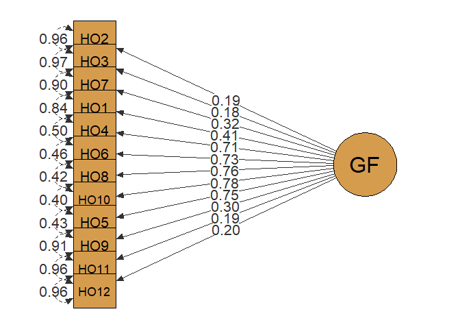
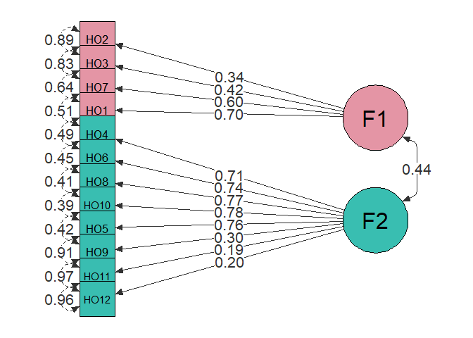
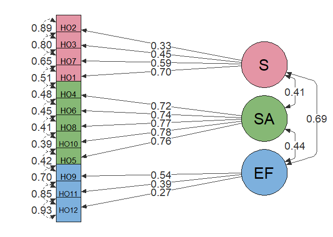
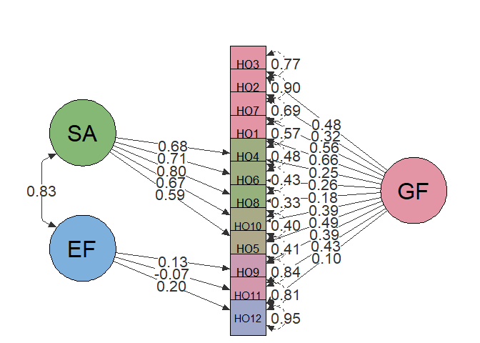
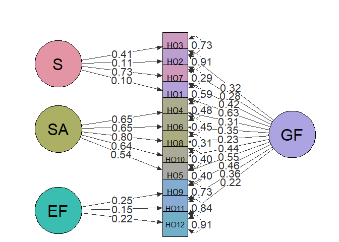
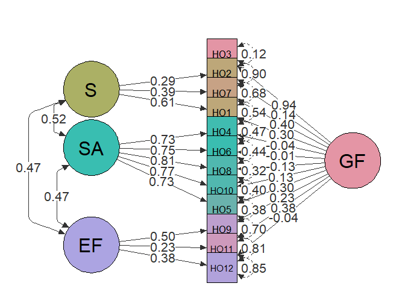
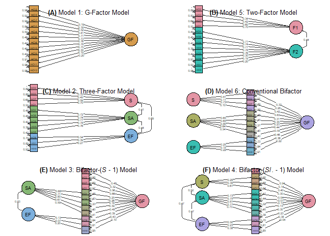

R-code for Online Repository
================
AZ
1/28/2021

## R Markdown

``` r
library(kableExtra)
library(matrixStats)
library(dplyr)
library(ggplot2)
library(rstatix)
library(readxl)
library(lavaan)
library(semPlot)
library(grid)
library(gridExtra)


HGSHS <- read_excel("Screening Data-2020.01.20-1,for-online.xlsx",col_names = TRUE)

HGSHS[,c("HO1",
         "HO2",
         "HO3",
         "HO4",
         "HO5",
         "HO6",
         "HO7",
         "HO8",
         "HO9",
         "HO10",
         "HO11",
         "HO12")] <-
     lapply(HGSHS[,c( "HO1",
                     "HO2",
                     "HO3",
                     "HO4",
                     "HO5",
                     "HO6",
                     "HO7",
                     "HO8",
                     "HO9",
                     "HO10",
                     "HO11",
                     "HO12")], ordered)
```

## Models

## Model 1: G-Factor Model

``` r
HGSHS.model.G <- ' GF  =~ HO2 + HO3 + HO7 + HO1 + HO4 + HO6 + 
                          HO8 + HO10 + HO5 + HO9 + HO11 + HO12'
                          

fitG <- cfa(HGSHS.model.G, data=HGSHS, std.lv=TRUE)

summary(fitG, fit.measures=TRUE)
```

    ## lavaan 0.6-19 ended normally after 10 iterations
    ## 
    ##   Estimator                                       DWLS
    ##   Optimization method                           NLMINB
    ##   Number of model parameters                        24
    ## 
    ##                                                   Used       Total
    ##   Number of observations                           474         477
    ## 
    ## Model Test User Model:
    ##                                               Standard      Scaled
    ##   Test Statistic                               142.602     169.934
    ##   Degrees of freedom                                54          54
    ##   P-value (Chi-square)                           0.000       0.000
    ##   Scaling correction factor                                  0.879
    ##   Shift parameter                                            7.635
    ##     simple second-order correction                                
    ## 
    ## Model Test Baseline Model:
    ## 
    ##   Test statistic                              1409.998    1089.075
    ##   Degrees of freedom                                66          66
    ##   P-value                                        0.000       0.000
    ##   Scaling correction factor                                  1.314
    ## 
    ## User Model versus Baseline Model:
    ## 
    ##   Comparative Fit Index (CFI)                    0.934       0.887
    ##   Tucker-Lewis Index (TLI)                       0.919       0.861
    ##                                                                   
    ##   Robust Comparative Fit Index (CFI)                         0.733
    ##   Robust Tucker-Lewis Index (TLI)                            0.673
    ## 
    ## Root Mean Square Error of Approximation:
    ## 
    ##   RMSEA                                          0.059       0.067
    ##   90 Percent confidence interval - lower         0.047       0.056
    ##   90 Percent confidence interval - upper         0.071       0.079
    ##   P-value H_0: RMSEA <= 0.050                    0.102       0.006
    ##   P-value H_0: RMSEA >= 0.080                    0.001       0.036
    ##                                                                   
    ##   Robust RMSEA                                               0.131
    ##   90 Percent confidence interval - lower                     0.107
    ##   90 Percent confidence interval - upper                     0.156
    ##   P-value H_0: Robust RMSEA <= 0.050                         0.000
    ##   P-value H_0: Robust RMSEA >= 0.080                         1.000
    ## 
    ## Standardized Root Mean Square Residual:
    ## 
    ##   SRMR                                           0.105       0.105
    ## 
    ## Parameter Estimates:
    ## 
    ##   Parameterization                               Delta
    ##   Standard errors                           Robust.sem
    ##   Information                                 Expected
    ##   Information saturated (h1) model        Unstructured
    ## 
    ## Latent Variables:
    ##                    Estimate  Std.Err  z-value  P(>|z|)
    ##   GF =~                                               
    ##     HO2               0.194    0.071    2.749    0.006
    ##     HO3               0.183    0.074    2.468    0.014
    ##     HO7               0.318    0.066    4.798    0.000
    ##     HO1               0.405    0.067    6.034    0.000
    ##     HO4               0.708    0.046   15.537    0.000
    ##     HO6               0.734    0.043   17.127    0.000
    ##     HO8               0.760    0.041   18.654    0.000
    ##     HO10              0.778    0.040   19.524    0.000
    ##     HO5               0.753    0.045   16.689    0.000
    ##     HO9               0.301    0.070    4.296    0.000
    ##     HO11              0.190    0.066    2.878    0.004
    ##     HO12              0.197    0.078    2.530    0.011
    ## 
    ## Thresholds:
    ##                    Estimate  Std.Err  z-value  P(>|z|)
    ##     HO2|t1           -0.526    0.061   -8.671    0.000
    ##     HO3|t1           -0.871    0.066  -13.129    0.000
    ##     HO7|t1           -0.581    0.061   -9.478    0.000
    ##     HO1|t1           -0.691    0.063  -10.985    0.000
    ##     HO4|t1           -0.064    0.058   -1.101    0.271
    ##     HO6|t1            0.021    0.058    0.367    0.714
    ##     HO8|t1           -0.016    0.058   -0.275    0.783
    ##     HO10|t1          -0.048    0.058   -0.826    0.409
    ##     HO5|t1           -0.379    0.059   -6.408    0.000
    ##     HO9|t1            0.951    0.068   13.946    0.000
    ##     HO11|t1           0.229    0.058    3.943    0.000
    ##     HO12|t1           1.163    0.074   15.657    0.000
    ## 
    ## Variances:
    ##                    Estimate  Std.Err  z-value  P(>|z|)
    ##    .HO2               0.962                           
    ##    .HO3               0.967                           
    ##    .HO7               0.899                           
    ##    .HO1               0.836                           
    ##    .HO4               0.498                           
    ##    .HO6               0.462                           
    ##    .HO8               0.423                           
    ##    .HO10              0.395                           
    ##    .HO5               0.432                           
    ##    .HO9               0.909                           
    ##    .HO11              0.964                           
    ##    .HO12              0.961                           
    ##     GF                1.000

``` r
parameterEstimates(fitG, standardized=TRUE)
```

    ##     lhs  op  rhs    est    se       z pvalue ci.lower ci.upper std.lv std.all
    ## 1    GF  =~  HO2  0.194 0.071   2.749  0.006    0.056    0.333  0.194   0.194
    ## 2    GF  =~  HO3  0.183 0.074   2.468  0.014    0.038    0.328  0.183   0.183
    ## 3    GF  =~  HO7  0.318 0.066   4.798  0.000    0.188    0.448  0.318   0.318
    ## 4    GF  =~  HO1  0.405 0.067   6.034  0.000    0.274    0.537  0.405   0.405
    ## 5    GF  =~  HO4  0.708 0.046  15.537  0.000    0.619    0.798  0.708   0.708
    ## 6    GF  =~  HO6  0.734 0.043  17.127  0.000    0.650    0.818  0.734   0.734
    ## 7    GF  =~  HO8  0.760 0.041  18.654  0.000    0.680    0.839  0.760   0.760
    ## 8    GF  =~ HO10  0.778 0.040  19.524  0.000    0.700    0.856  0.778   0.778
    ## 9    GF  =~  HO5  0.753 0.045  16.689  0.000    0.665    0.842  0.753   0.753
    ## 10   GF  =~  HO9  0.301 0.070   4.296  0.000    0.164    0.439  0.301   0.301
    ## 11   GF  =~ HO11  0.190 0.066   2.878  0.004    0.061    0.319  0.190   0.190
    ## 12   GF  =~ HO12  0.197 0.078   2.530  0.011    0.044    0.350  0.197   0.197
    ## 13  HO2   |   t1 -0.526 0.061  -8.671  0.000   -0.644   -0.407 -0.526  -0.526
    ## 14  HO3   |   t1 -0.871 0.066 -13.129  0.000   -1.001   -0.741 -0.871  -0.871
    ## 15  HO7   |   t1 -0.581 0.061  -9.478  0.000   -0.701   -0.461 -0.581  -0.581
    ## 16  HO1   |   t1 -0.691 0.063 -10.985  0.000   -0.815   -0.568 -0.691  -0.691
    ## 17  HO4   |   t1 -0.064 0.058  -1.101  0.271   -0.177    0.050 -0.064  -0.064
    ## 18  HO6   |   t1  0.021 0.058   0.367  0.714   -0.092    0.134  0.021   0.021
    ## 19  HO8   |   t1 -0.016 0.058  -0.275  0.783   -0.129    0.097 -0.016  -0.016
    ## 20 HO10   |   t1 -0.048 0.058  -0.826  0.409   -0.161    0.065 -0.048  -0.048
    ## 21  HO5   |   t1 -0.379 0.059  -6.408  0.000   -0.495   -0.263 -0.379  -0.379
    ## 22  HO9   |   t1  0.951 0.068  13.946  0.000    0.817    1.084  0.951   0.951
    ## 23 HO11   |   t1  0.229 0.058   3.943  0.000    0.115    0.343  0.229   0.229
    ## 24 HO12   |   t1  1.163 0.074  15.657  0.000    1.018    1.309  1.163   1.163
    ## 25  HO2  ~~  HO2  0.962 0.000      NA     NA    0.962    0.962  0.962   0.962
    ## 26  HO3  ~~  HO3  0.967 0.000      NA     NA    0.967    0.967  0.967   0.967
    ## 27  HO7  ~~  HO7  0.899 0.000      NA     NA    0.899    0.899  0.899   0.899
    ## 28  HO1  ~~  HO1  0.836 0.000      NA     NA    0.836    0.836  0.836   0.836
    ## 29  HO4  ~~  HO4  0.498 0.000      NA     NA    0.498    0.498  0.498   0.498
    ## 30  HO6  ~~  HO6  0.462 0.000      NA     NA    0.462    0.462  0.462   0.462
    ## 31  HO8  ~~  HO8  0.423 0.000      NA     NA    0.423    0.423  0.423   0.423
    ## 32 HO10  ~~ HO10  0.395 0.000      NA     NA    0.395    0.395  0.395   0.395
    ## 33  HO5  ~~  HO5  0.432 0.000      NA     NA    0.432    0.432  0.432   0.432
    ## 34  HO9  ~~  HO9  0.909 0.000      NA     NA    0.909    0.909  0.909   0.909
    ## 35 HO11  ~~ HO11  0.964 0.000      NA     NA    0.964    0.964  0.964   0.964
    ## 36 HO12  ~~ HO12  0.961 0.000      NA     NA    0.961    0.961  0.961   0.961
    ## 37   GF  ~~   GF  1.000 0.000      NA     NA    1.000    1.000  1.000   1.000
    ## 38  HO2 ~*~  HO2  1.000 0.000      NA     NA    1.000    1.000  1.000   1.000
    ## 39  HO3 ~*~  HO3  1.000 0.000      NA     NA    1.000    1.000  1.000   1.000
    ## 40  HO7 ~*~  HO7  1.000 0.000      NA     NA    1.000    1.000  1.000   1.000
    ## 41  HO1 ~*~  HO1  1.000 0.000      NA     NA    1.000    1.000  1.000   1.000
    ## 42  HO4 ~*~  HO4  1.000 0.000      NA     NA    1.000    1.000  1.000   1.000
    ## 43  HO6 ~*~  HO6  1.000 0.000      NA     NA    1.000    1.000  1.000   1.000
    ## 44  HO8 ~*~  HO8  1.000 0.000      NA     NA    1.000    1.000  1.000   1.000
    ## 45 HO10 ~*~ HO10  1.000 0.000      NA     NA    1.000    1.000  1.000   1.000
    ## 46  HO5 ~*~  HO5  1.000 0.000      NA     NA    1.000    1.000  1.000   1.000
    ## 47  HO9 ~*~  HO9  1.000 0.000      NA     NA    1.000    1.000  1.000   1.000
    ## 48 HO11 ~*~ HO11  1.000 0.000      NA     NA    1.000    1.000  1.000   1.000
    ## 49 HO12 ~*~ HO12  1.000 0.000      NA     NA    1.000    1.000  1.000   1.000
    ## 50  HO2  ~1       0.000 0.000      NA     NA    0.000    0.000  0.000   0.000
    ## 51  HO3  ~1       0.000 0.000      NA     NA    0.000    0.000  0.000   0.000
    ## 52  HO7  ~1       0.000 0.000      NA     NA    0.000    0.000  0.000   0.000
    ## 53  HO1  ~1       0.000 0.000      NA     NA    0.000    0.000  0.000   0.000
    ## 54  HO4  ~1       0.000 0.000      NA     NA    0.000    0.000  0.000   0.000
    ## 55  HO6  ~1       0.000 0.000      NA     NA    0.000    0.000  0.000   0.000
    ## 56  HO8  ~1       0.000 0.000      NA     NA    0.000    0.000  0.000   0.000
    ## 57 HO10  ~1       0.000 0.000      NA     NA    0.000    0.000  0.000   0.000
    ## 58  HO5  ~1       0.000 0.000      NA     NA    0.000    0.000  0.000   0.000
    ## 59  HO9  ~1       0.000 0.000      NA     NA    0.000    0.000  0.000   0.000
    ## 60 HO11  ~1       0.000 0.000      NA     NA    0.000    0.000  0.000   0.000
    ## 61 HO12  ~1       0.000 0.000      NA     NA    0.000    0.000  0.000   0.000
    ## 62   GF  ~1       0.000 0.000      NA     NA    0.000    0.000  0.000   0.000

``` r
G1 <- semPaths(fitG, "std", edge.label.cex = 1.5, exoVar = FALSE,layout = "tree3",
         curvePivot = TRUE,curvature = 2,thresholds = 0, intercepts = FALSE,
         rotation = 4,
         sizeMan = 10, sizeMan2 = 8, sizeLat = 15, asize =4 , weighted = F,
         pastel = TRUE, color = list(lat = rgb(214,156,78, maxColorValue = 255),
         man = rgb(214,156,78, maxColorValue = 255)),
         edge.color = rgb(50,50,50, maxColorValue = 255),
         mar = c(3,7,3,7),style = "OpenMx",)
```

<!-- -->

## Model 5: Two-Factor Model

``` r
HGSHS.model.extra1 <- 'F1  =~ HO2 + HO3 + HO7 + HO1  
                       F2  =~ HO4 + HO6 + HO8 + HO10 + HO5 + 
                       HO9 + HO11 + HO12'

fitextra1 <- cfa(HGSHS.model.extra1,std.lv=TRUE, data=HGSHS)

summary(fitextra1, fit.measures=TRUE)
```

    ## lavaan 0.6-19 ended normally after 13 iterations
    ## 
    ##   Estimator                                       DWLS
    ##   Optimization method                           NLMINB
    ##   Number of model parameters                        25
    ## 
    ##                                                   Used       Total
    ##   Number of observations                           474         477
    ## 
    ## Model Test User Model:
    ##                                               Standard      Scaled
    ##   Test Statistic                               101.883     122.114
    ##   Degrees of freedom                                53          53
    ##   P-value (Chi-square)                           0.000       0.000
    ##   Scaling correction factor                                  0.888
    ##   Shift parameter                                            7.392
    ##     simple second-order correction                                
    ## 
    ## Model Test Baseline Model:
    ## 
    ##   Test statistic                              1409.998    1089.075
    ##   Degrees of freedom                                66          66
    ##   P-value                                        0.000       0.000
    ##   Scaling correction factor                                  1.314
    ## 
    ## User Model versus Baseline Model:
    ## 
    ##   Comparative Fit Index (CFI)                    0.964       0.932
    ##   Tucker-Lewis Index (TLI)                       0.955       0.916
    ##                                                                   
    ##   Robust Comparative Fit Index (CFI)                         0.810
    ##   Robust Tucker-Lewis Index (TLI)                            0.764
    ## 
    ## Root Mean Square Error of Approximation:
    ## 
    ##   RMSEA                                          0.044       0.053
    ##   90 Percent confidence interval - lower         0.031       0.040
    ##   90 Percent confidence interval - upper         0.057       0.065
    ##   P-value H_0: RMSEA <= 0.050                    0.761       0.351
    ##   P-value H_0: RMSEA >= 0.080                    0.000       0.000
    ##                                                                   
    ##   Robust RMSEA                                               0.112
    ##   90 Percent confidence interval - lower                     0.085
    ##   90 Percent confidence interval - upper                     0.139
    ##   P-value H_0: Robust RMSEA <= 0.050                         0.000
    ##   P-value H_0: Robust RMSEA >= 0.080                         0.972
    ## 
    ## Standardized Root Mean Square Residual:
    ## 
    ##   SRMR                                           0.090       0.090
    ## 
    ## Parameter Estimates:
    ## 
    ##   Parameterization                               Delta
    ##   Standard errors                           Robust.sem
    ##   Information                                 Expected
    ##   Information saturated (h1) model        Unstructured
    ## 
    ## Latent Variables:
    ##                    Estimate  Std.Err  z-value  P(>|z|)
    ##   F1 =~                                               
    ##     HO2               0.338    0.092    3.677    0.000
    ##     HO3               0.416    0.093    4.474    0.000
    ##     HO7               0.602    0.087    6.897    0.000
    ##     HO1               0.703    0.101    6.988    0.000
    ##   F2 =~                                               
    ##     HO4               0.714    0.046   15.619    0.000
    ##     HO6               0.740    0.043   17.275    0.000
    ##     HO8               0.766    0.041   18.820    0.000
    ##     HO10              0.781    0.040   19.427    0.000
    ##     HO5               0.758    0.046   16.649    0.000
    ##     HO9               0.298    0.071    4.200    0.000
    ##     HO11              0.185    0.067    2.776    0.005
    ##     HO12              0.200    0.078    2.571    0.010
    ## 
    ## Covariances:
    ##                    Estimate  Std.Err  z-value  P(>|z|)
    ##   F1 ~~                                               
    ##     F2                0.443    0.077    5.785    0.000
    ## 
    ## Thresholds:
    ##                    Estimate  Std.Err  z-value  P(>|z|)
    ##     HO2|t1           -0.526    0.061   -8.671    0.000
    ##     HO3|t1           -0.871    0.066  -13.129    0.000
    ##     HO7|t1           -0.581    0.061   -9.478    0.000
    ##     HO1|t1           -0.691    0.063  -10.985    0.000
    ##     HO4|t1           -0.064    0.058   -1.101    0.271
    ##     HO6|t1            0.021    0.058    0.367    0.714
    ##     HO8|t1           -0.016    0.058   -0.275    0.783
    ##     HO10|t1          -0.048    0.058   -0.826    0.409
    ##     HO5|t1           -0.379    0.059   -6.408    0.000
    ##     HO9|t1            0.951    0.068   13.946    0.000
    ##     HO11|t1           0.229    0.058    3.943    0.000
    ##     HO12|t1           1.163    0.074   15.657    0.000
    ## 
    ## Variances:
    ##                    Estimate  Std.Err  z-value  P(>|z|)
    ##    .HO2               0.885                           
    ##    .HO3               0.827                           
    ##    .HO7               0.638                           
    ##    .HO1               0.506                           
    ##    .HO4               0.491                           
    ##    .HO6               0.452                           
    ##    .HO8               0.413                           
    ##    .HO10              0.390                           
    ##    .HO5               0.425                           
    ##    .HO9               0.911                           
    ##    .HO11              0.966                           
    ##    .HO12              0.960                           
    ##     F1                1.000                           
    ##     F2                1.000

``` r
parameterEstimates(fitextra1, standardized=TRUE)
```

    ##     lhs  op  rhs    est    se       z pvalue ci.lower ci.upper std.lv std.all
    ## 1    F1  =~  HO2  0.338 0.092   3.677  0.000    0.158    0.519  0.338   0.338
    ## 2    F1  =~  HO3  0.416 0.093   4.474  0.000    0.234    0.598  0.416   0.416
    ## 3    F1  =~  HO7  0.602 0.087   6.897  0.000    0.431    0.773  0.602   0.602
    ## 4    F1  =~  HO1  0.703 0.101   6.988  0.000    0.506    0.900  0.703   0.703
    ## 5    F2  =~  HO4  0.714 0.046  15.619  0.000    0.624    0.803  0.714   0.714
    ## 6    F2  =~  HO6  0.740 0.043  17.275  0.000    0.656    0.825  0.740   0.740
    ## 7    F2  =~  HO8  0.766 0.041  18.820  0.000    0.686    0.846  0.766   0.766
    ## 8    F2  =~ HO10  0.781 0.040  19.427  0.000    0.702    0.860  0.781   0.781
    ## 9    F2  =~  HO5  0.758 0.046  16.649  0.000    0.669    0.848  0.758   0.758
    ## 10   F2  =~  HO9  0.298 0.071   4.200  0.000    0.159    0.437  0.298   0.298
    ## 11   F2  =~ HO11  0.185 0.067   2.776  0.005    0.054    0.316  0.185   0.185
    ## 12   F2  =~ HO12  0.200 0.078   2.571  0.010    0.048    0.352  0.200   0.200
    ## 13  HO2   |   t1 -0.526 0.061  -8.671  0.000   -0.644   -0.407 -0.526  -0.526
    ## 14  HO3   |   t1 -0.871 0.066 -13.129  0.000   -1.001   -0.741 -0.871  -0.871
    ## 15  HO7   |   t1 -0.581 0.061  -9.478  0.000   -0.701   -0.461 -0.581  -0.581
    ## 16  HO1   |   t1 -0.691 0.063 -10.985  0.000   -0.815   -0.568 -0.691  -0.691
    ## 17  HO4   |   t1 -0.064 0.058  -1.101  0.271   -0.177    0.050 -0.064  -0.064
    ## 18  HO6   |   t1  0.021 0.058   0.367  0.714   -0.092    0.134  0.021   0.021
    ## 19  HO8   |   t1 -0.016 0.058  -0.275  0.783   -0.129    0.097 -0.016  -0.016
    ## 20 HO10   |   t1 -0.048 0.058  -0.826  0.409   -0.161    0.065 -0.048  -0.048
    ## 21  HO5   |   t1 -0.379 0.059  -6.408  0.000   -0.495   -0.263 -0.379  -0.379
    ## 22  HO9   |   t1  0.951 0.068  13.946  0.000    0.817    1.084  0.951   0.951
    ## 23 HO11   |   t1  0.229 0.058   3.943  0.000    0.115    0.343  0.229   0.229
    ## 24 HO12   |   t1  1.163 0.074  15.657  0.000    1.018    1.309  1.163   1.163
    ## 25  HO2  ~~  HO2  0.885 0.000      NA     NA    0.885    0.885  0.885   0.885
    ## 26  HO3  ~~  HO3  0.827 0.000      NA     NA    0.827    0.827  0.827   0.827
    ## 27  HO7  ~~  HO7  0.638 0.000      NA     NA    0.638    0.638  0.638   0.638
    ## 28  HO1  ~~  HO1  0.506 0.000      NA     NA    0.506    0.506  0.506   0.506
    ## 29  HO4  ~~  HO4  0.491 0.000      NA     NA    0.491    0.491  0.491   0.491
    ## 30  HO6  ~~  HO6  0.452 0.000      NA     NA    0.452    0.452  0.452   0.452
    ## 31  HO8  ~~  HO8  0.413 0.000      NA     NA    0.413    0.413  0.413   0.413
    ## 32 HO10  ~~ HO10  0.390 0.000      NA     NA    0.390    0.390  0.390   0.390
    ## 33  HO5  ~~  HO5  0.425 0.000      NA     NA    0.425    0.425  0.425   0.425
    ## 34  HO9  ~~  HO9  0.911 0.000      NA     NA    0.911    0.911  0.911   0.911
    ## 35 HO11  ~~ HO11  0.966 0.000      NA     NA    0.966    0.966  0.966   0.966
    ## 36 HO12  ~~ HO12  0.960 0.000      NA     NA    0.960    0.960  0.960   0.960
    ## 37   F1  ~~   F1  1.000 0.000      NA     NA    1.000    1.000  1.000   1.000
    ## 38   F2  ~~   F2  1.000 0.000      NA     NA    1.000    1.000  1.000   1.000
    ## 39   F1  ~~   F2  0.443 0.077   5.785  0.000    0.293    0.593  0.443   0.443
    ## 40  HO2 ~*~  HO2  1.000 0.000      NA     NA    1.000    1.000  1.000   1.000
    ## 41  HO3 ~*~  HO3  1.000 0.000      NA     NA    1.000    1.000  1.000   1.000
    ## 42  HO7 ~*~  HO7  1.000 0.000      NA     NA    1.000    1.000  1.000   1.000
    ## 43  HO1 ~*~  HO1  1.000 0.000      NA     NA    1.000    1.000  1.000   1.000
    ## 44  HO4 ~*~  HO4  1.000 0.000      NA     NA    1.000    1.000  1.000   1.000
    ## 45  HO6 ~*~  HO6  1.000 0.000      NA     NA    1.000    1.000  1.000   1.000
    ## 46  HO8 ~*~  HO8  1.000 0.000      NA     NA    1.000    1.000  1.000   1.000
    ## 47 HO10 ~*~ HO10  1.000 0.000      NA     NA    1.000    1.000  1.000   1.000
    ## 48  HO5 ~*~  HO5  1.000 0.000      NA     NA    1.000    1.000  1.000   1.000
    ## 49  HO9 ~*~  HO9  1.000 0.000      NA     NA    1.000    1.000  1.000   1.000
    ## 50 HO11 ~*~ HO11  1.000 0.000      NA     NA    1.000    1.000  1.000   1.000
    ## 51 HO12 ~*~ HO12  1.000 0.000      NA     NA    1.000    1.000  1.000   1.000
    ## 52  HO2  ~1       0.000 0.000      NA     NA    0.000    0.000  0.000   0.000
    ## 53  HO3  ~1       0.000 0.000      NA     NA    0.000    0.000  0.000   0.000
    ## 54  HO7  ~1       0.000 0.000      NA     NA    0.000    0.000  0.000   0.000
    ## 55  HO1  ~1       0.000 0.000      NA     NA    0.000    0.000  0.000   0.000
    ## 56  HO4  ~1       0.000 0.000      NA     NA    0.000    0.000  0.000   0.000
    ## 57  HO6  ~1       0.000 0.000      NA     NA    0.000    0.000  0.000   0.000
    ## 58  HO8  ~1       0.000 0.000      NA     NA    0.000    0.000  0.000   0.000
    ## 59 HO10  ~1       0.000 0.000      NA     NA    0.000    0.000  0.000   0.000
    ## 60  HO5  ~1       0.000 0.000      NA     NA    0.000    0.000  0.000   0.000
    ## 61  HO9  ~1       0.000 0.000      NA     NA    0.000    0.000  0.000   0.000
    ## 62 HO11  ~1       0.000 0.000      NA     NA    0.000    0.000  0.000   0.000
    ## 63 HO12  ~1       0.000 0.000      NA     NA    0.000    0.000  0.000   0.000
    ## 64   F1  ~1       0.000 0.000      NA     NA    0.000    0.000  0.000   0.000
    ## 65   F2  ~1       0.000 0.000      NA     NA    0.000    0.000  0.000   0.000

``` r
anova(fitextra1,fitG)
```

    ## 
    ## Scaled Chi-Squared Difference Test (method = "satorra.2000")
    ## 
    ## lavaan->lavTestLRT():  
    ##    lavaan NOTE: The "Chisq" column contains standard test statistics, not the 
    ##    robust test that should be reported per model. A robust difference test is 
    ##    a function of two standard (not robust) statistics.
    ##           Df AIC BIC  Chisq Chisq diff Df diff Pr(>Chisq)    
    ## fitextra1 53         101.88                                  
    ## fitG      54         142.60     31.363       1   2.14e-08 ***
    ## ---
    ## Signif. codes:  0 '***' 0.001 '**' 0.01 '*' 0.05 '.' 0.1 ' ' 1

``` r
G2 <- semPaths(fitextra1, "std",  edge.label.cex = 1.5, exoVar = FALSE,
         layout = "tree3",
         curvePivot = TRUE,curvature = 2,thresholds = 0,
         intercepts = FALSE,rotation = 4,
         sizeMan = 8, sizeMan2 = 8, sizeLat = 15, asize =4 , weighted = F,
         pastel = TRUE, groups = "latents",
         edge.color = rgb(50,50,50, maxColorValue = 255),
         mar = c(3,7,3,7),style = "OpenMx",)
```

<!-- -->

## Model 2: Three-Factor Model

``` r
HGSHS.model.threenested <- 'S  =~ HO2 + HO3 + HO7 + HO1  
                            SA  =~ HO4 + HO6 + HO8 + HO10 + HO5
                            EF  =~ HO9 + HO11 + HO12'

fit3n <- cfa(HGSHS.model.threenested, data=HGSHS, std.lv=TRUE)

summary(fit3n, fit.measures=TRUE)
```

    ## lavaan 0.6-19 ended normally after 22 iterations
    ## 
    ##   Estimator                                       DWLS
    ##   Optimization method                           NLMINB
    ##   Number of model parameters                        27
    ## 
    ##                                                   Used       Total
    ##   Number of observations                           474         477
    ## 
    ## Model Test User Model:
    ##                                               Standard      Scaled
    ##   Test Statistic                                80.575      99.062
    ##   Degrees of freedom                                51          51
    ##   P-value (Chi-square)                           0.005       0.000
    ##   Scaling correction factor                                  0.875
    ##   Shift parameter                                            7.026
    ##     simple second-order correction                                
    ## 
    ## Model Test Baseline Model:
    ## 
    ##   Test statistic                              1409.998    1089.075
    ##   Degrees of freedom                                66          66
    ##   P-value                                        0.000       0.000
    ##   Scaling correction factor                                  1.314
    ## 
    ## User Model versus Baseline Model:
    ## 
    ##   Comparative Fit Index (CFI)                    0.978       0.953
    ##   Tucker-Lewis Index (TLI)                       0.972       0.939
    ##                                                                   
    ##   Robust Comparative Fit Index (CFI)                         0.844
    ##   Robust Tucker-Lewis Index (TLI)                            0.798
    ## 
    ## Root Mean Square Error of Approximation:
    ## 
    ##   RMSEA                                          0.035       0.045
    ##   90 Percent confidence interval - lower         0.019       0.031
    ##   90 Percent confidence interval - upper         0.049       0.058
    ##   P-value H_0: RMSEA <= 0.050                    0.961       0.737
    ##   P-value H_0: RMSEA >= 0.080                    0.000       0.000
    ##                                                                   
    ##   Robust RMSEA                                               0.103
    ##   90 Percent confidence interval - lower                     0.074
    ##   90 Percent confidence interval - upper                     0.132
    ##   P-value H_0: Robust RMSEA <= 0.050                         0.002
    ##   P-value H_0: Robust RMSEA >= 0.080                         0.912
    ## 
    ## Standardized Root Mean Square Residual:
    ## 
    ##   SRMR                                           0.079       0.079
    ## 
    ## Parameter Estimates:
    ## 
    ##   Parameterization                               Delta
    ##   Standard errors                           Robust.sem
    ##   Information                                 Expected
    ##   Information saturated (h1) model        Unstructured
    ## 
    ## Latent Variables:
    ##                    Estimate  Std.Err  z-value  P(>|z|)
    ##   S =~                                                
    ##     HO2               0.333    0.090    3.695    0.000
    ##     HO3               0.445    0.091    4.903    0.000
    ##     HO7               0.590    0.084    7.060    0.000
    ##     HO1               0.700    0.096    7.289    0.000
    ##   SA =~                                               
    ##     HO4               0.719    0.046   15.748    0.000
    ##     HO6               0.742    0.043   17.281    0.000
    ##     HO8               0.771    0.041   18.972    0.000
    ##     HO10              0.784    0.040   19.461    0.000
    ##     HO5               0.761    0.046   16.641    0.000
    ##   EF =~                                               
    ##     HO9               0.544    0.119    4.579    0.000
    ##     HO11              0.387    0.100    3.860    0.000
    ##     HO12              0.273    0.116    2.361    0.018
    ## 
    ## Covariances:
    ##                    Estimate  Std.Err  z-value  P(>|z|)
    ##   S ~~                                                
    ##     SA                0.409    0.077    5.291    0.000
    ##     EF                0.688    0.165    4.159    0.000
    ##   SA ~~                                               
    ##     EF                0.441    0.122    3.603    0.000
    ## 
    ## Thresholds:
    ##                    Estimate  Std.Err  z-value  P(>|z|)
    ##     HO2|t1           -0.526    0.061   -8.671    0.000
    ##     HO3|t1           -0.871    0.066  -13.129    0.000
    ##     HO7|t1           -0.581    0.061   -9.478    0.000
    ##     HO1|t1           -0.691    0.063  -10.985    0.000
    ##     HO4|t1           -0.064    0.058   -1.101    0.271
    ##     HO6|t1            0.021    0.058    0.367    0.714
    ##     HO8|t1           -0.016    0.058   -0.275    0.783
    ##     HO10|t1          -0.048    0.058   -0.826    0.409
    ##     HO5|t1           -0.379    0.059   -6.408    0.000
    ##     HO9|t1            0.951    0.068   13.946    0.000
    ##     HO11|t1           0.229    0.058    3.943    0.000
    ##     HO12|t1           1.163    0.074   15.657    0.000
    ## 
    ## Variances:
    ##                    Estimate  Std.Err  z-value  P(>|z|)
    ##    .HO2               0.889                           
    ##    .HO3               0.802                           
    ##    .HO7               0.652                           
    ##    .HO1               0.511                           
    ##    .HO4               0.484                           
    ##    .HO6               0.449                           
    ##    .HO8               0.405                           
    ##    .HO10              0.386                           
    ##    .HO5               0.421                           
    ##    .HO9               0.704                           
    ##    .HO11              0.850                           
    ##    .HO12              0.925                           
    ##     S                 1.000                           
    ##     SA                1.000                           
    ##     EF                1.000

``` r
parameterEstimates(fit3n, standardized=TRUE)
```

    ##     lhs  op  rhs    est    se       z pvalue ci.lower ci.upper std.lv std.all
    ## 1     S  =~  HO2  0.333 0.090   3.695  0.000    0.156    0.509  0.333   0.333
    ## 2     S  =~  HO3  0.445 0.091   4.903  0.000    0.267    0.623  0.445   0.445
    ## 3     S  =~  HO7  0.590 0.084   7.060  0.000    0.426    0.754  0.590   0.590
    ## 4     S  =~  HO1  0.700 0.096   7.289  0.000    0.511    0.888  0.700   0.700
    ## 5    SA  =~  HO4  0.719 0.046  15.748  0.000    0.629    0.808  0.719   0.719
    ## 6    SA  =~  HO6  0.742 0.043  17.281  0.000    0.658    0.826  0.742   0.742
    ## 7    SA  =~  HO8  0.771 0.041  18.972  0.000    0.692    0.851  0.771   0.771
    ## 8    SA  =~ HO10  0.784 0.040  19.461  0.000    0.705    0.863  0.784   0.784
    ## 9    SA  =~  HO5  0.761 0.046  16.641  0.000    0.671    0.851  0.761   0.761
    ## 10   EF  =~  HO9  0.544 0.119   4.579  0.000    0.311    0.778  0.544   0.544
    ## 11   EF  =~ HO11  0.387 0.100   3.860  0.000    0.191    0.584  0.387   0.387
    ## 12   EF  =~ HO12  0.273 0.116   2.361  0.018    0.046    0.500  0.273   0.273
    ## 13  HO2   |   t1 -0.526 0.061  -8.671  0.000   -0.644   -0.407 -0.526  -0.526
    ## 14  HO3   |   t1 -0.871 0.066 -13.129  0.000   -1.001   -0.741 -0.871  -0.871
    ## 15  HO7   |   t1 -0.581 0.061  -9.478  0.000   -0.701   -0.461 -0.581  -0.581
    ## 16  HO1   |   t1 -0.691 0.063 -10.985  0.000   -0.815   -0.568 -0.691  -0.691
    ## 17  HO4   |   t1 -0.064 0.058  -1.101  0.271   -0.177    0.050 -0.064  -0.064
    ## 18  HO6   |   t1  0.021 0.058   0.367  0.714   -0.092    0.134  0.021   0.021
    ## 19  HO8   |   t1 -0.016 0.058  -0.275  0.783   -0.129    0.097 -0.016  -0.016
    ## 20 HO10   |   t1 -0.048 0.058  -0.826  0.409   -0.161    0.065 -0.048  -0.048
    ## 21  HO5   |   t1 -0.379 0.059  -6.408  0.000   -0.495   -0.263 -0.379  -0.379
    ## 22  HO9   |   t1  0.951 0.068  13.946  0.000    0.817    1.084  0.951   0.951
    ## 23 HO11   |   t1  0.229 0.058   3.943  0.000    0.115    0.343  0.229   0.229
    ## 24 HO12   |   t1  1.163 0.074  15.657  0.000    1.018    1.309  1.163   1.163
    ## 25  HO2  ~~  HO2  0.889 0.000      NA     NA    0.889    0.889  0.889   0.889
    ## 26  HO3  ~~  HO3  0.802 0.000      NA     NA    0.802    0.802  0.802   0.802
    ## 27  HO7  ~~  HO7  0.652 0.000      NA     NA    0.652    0.652  0.652   0.652
    ## 28  HO1  ~~  HO1  0.511 0.000      NA     NA    0.511    0.511  0.511   0.511
    ## 29  HO4  ~~  HO4  0.484 0.000      NA     NA    0.484    0.484  0.484   0.484
    ## 30  HO6  ~~  HO6  0.449 0.000      NA     NA    0.449    0.449  0.449   0.449
    ## 31  HO8  ~~  HO8  0.405 0.000      NA     NA    0.405    0.405  0.405   0.405
    ## 32 HO10  ~~ HO10  0.386 0.000      NA     NA    0.386    0.386  0.386   0.386
    ## 33  HO5  ~~  HO5  0.421 0.000      NA     NA    0.421    0.421  0.421   0.421
    ## 34  HO9  ~~  HO9  0.704 0.000      NA     NA    0.704    0.704  0.704   0.704
    ## 35 HO11  ~~ HO11  0.850 0.000      NA     NA    0.850    0.850  0.850   0.850
    ## 36 HO12  ~~ HO12  0.925 0.000      NA     NA    0.925    0.925  0.925   0.925
    ## 37    S  ~~    S  1.000 0.000      NA     NA    1.000    1.000  1.000   1.000
    ## 38   SA  ~~   SA  1.000 0.000      NA     NA    1.000    1.000  1.000   1.000
    ## 39   EF  ~~   EF  1.000 0.000      NA     NA    1.000    1.000  1.000   1.000
    ## 40    S  ~~   SA  0.409 0.077   5.291  0.000    0.257    0.560  0.409   0.409
    ## 41    S  ~~   EF  0.688 0.165   4.159  0.000    0.364    1.012  0.688   0.688
    ## 42   SA  ~~   EF  0.441 0.122   3.603  0.000    0.201    0.681  0.441   0.441
    ## 43  HO2 ~*~  HO2  1.000 0.000      NA     NA    1.000    1.000  1.000   1.000
    ## 44  HO3 ~*~  HO3  1.000 0.000      NA     NA    1.000    1.000  1.000   1.000
    ## 45  HO7 ~*~  HO7  1.000 0.000      NA     NA    1.000    1.000  1.000   1.000
    ## 46  HO1 ~*~  HO1  1.000 0.000      NA     NA    1.000    1.000  1.000   1.000
    ## 47  HO4 ~*~  HO4  1.000 0.000      NA     NA    1.000    1.000  1.000   1.000
    ## 48  HO6 ~*~  HO6  1.000 0.000      NA     NA    1.000    1.000  1.000   1.000
    ## 49  HO8 ~*~  HO8  1.000 0.000      NA     NA    1.000    1.000  1.000   1.000
    ## 50 HO10 ~*~ HO10  1.000 0.000      NA     NA    1.000    1.000  1.000   1.000
    ## 51  HO5 ~*~  HO5  1.000 0.000      NA     NA    1.000    1.000  1.000   1.000
    ## 52  HO9 ~*~  HO9  1.000 0.000      NA     NA    1.000    1.000  1.000   1.000
    ## 53 HO11 ~*~ HO11  1.000 0.000      NA     NA    1.000    1.000  1.000   1.000
    ## 54 HO12 ~*~ HO12  1.000 0.000      NA     NA    1.000    1.000  1.000   1.000
    ## 55  HO2  ~1       0.000 0.000      NA     NA    0.000    0.000  0.000   0.000
    ## 56  HO3  ~1       0.000 0.000      NA     NA    0.000    0.000  0.000   0.000
    ## 57  HO7  ~1       0.000 0.000      NA     NA    0.000    0.000  0.000   0.000
    ## 58  HO1  ~1       0.000 0.000      NA     NA    0.000    0.000  0.000   0.000
    ## 59  HO4  ~1       0.000 0.000      NA     NA    0.000    0.000  0.000   0.000
    ## 60  HO6  ~1       0.000 0.000      NA     NA    0.000    0.000  0.000   0.000
    ## 61  HO8  ~1       0.000 0.000      NA     NA    0.000    0.000  0.000   0.000
    ## 62 HO10  ~1       0.000 0.000      NA     NA    0.000    0.000  0.000   0.000
    ## 63  HO5  ~1       0.000 0.000      NA     NA    0.000    0.000  0.000   0.000
    ## 64  HO9  ~1       0.000 0.000      NA     NA    0.000    0.000  0.000   0.000
    ## 65 HO11  ~1       0.000 0.000      NA     NA    0.000    0.000  0.000   0.000
    ## 66 HO12  ~1       0.000 0.000      NA     NA    0.000    0.000  0.000   0.000
    ## 67    S  ~1       0.000 0.000      NA     NA    0.000    0.000  0.000   0.000
    ## 68   SA  ~1       0.000 0.000      NA     NA    0.000    0.000  0.000   0.000
    ## 69   EF  ~1       0.000 0.000      NA     NA    0.000    0.000  0.000   0.000

``` r
anova(fit3n,fitextra1)
```

    ## 
    ## Scaled Chi-Squared Difference Test (method = "satorra.2000")
    ## 
    ## lavaan->lavTestLRT():  
    ##    lavaan NOTE: The "Chisq" column contains standard test statistics, not the 
    ##    robust test that should be reported per model. A robust difference test is 
    ##    a function of two standard (not robust) statistics.
    ##           Df AIC BIC   Chisq Chisq diff Df diff Pr(>Chisq)    
    ## fit3n     51          80.575                                  
    ## fitextra1 53         101.883     16.823       2  0.0002223 ***
    ## ---
    ## Signif. codes:  0 '***' 0.001 '**' 0.01 '*' 0.05 '.' 0.1 ' ' 1

``` r
G3 <- semPaths(fit3n, "std",  edge.label.cex = 1.5, exoVar = FALSE,layout = "tree3",
         curvePivot = TRUE,curvature = 2,thresholds = 0,
         intercepts = FALSE,rotation = 4,
         sizeMan = 8, sizeMan2 = 8, sizeLat = 15, asize =4 , weighted = F,
         pastel = TRUE, groups = "latents",
         edge.color = rgb(50,50,50, maxColorValue = 255),
         mar = c(3,7,3,7),style = "OpenMx",)
```

<!-- -->

## Model 6: Conventional Bifactor

``` r
HGSHS.modelc2.bifactor <- 'GF  =~ HO3 + HO2 + HO7 + HO1 + HO4 + HO6 + HO8 +
                                  HO10 + HO5 + HO9 + HO11 + HO12
                          
                          SA  =~  HO4 + HO6  + HO8 + HO10 + HO5
                          EF  =~  HO12 +HO11+HO9
                          SA~~EF
                          GF~~0*EF
                          GF~~0*SA'

fitBic2 <- cfa(HGSHS.modelc2.bifactor,std.lv=TRUE, data=HGSHS)

summary(fitBic2, fit.measures=TRUE)
```

    ## lavaan 0.6-19 ended normally after 53 iterations
    ## 
    ##   Estimator                                       DWLS
    ##   Optimization method                           NLMINB
    ##   Number of model parameters                        33
    ## 
    ##                                                   Used       Total
    ##   Number of observations                           474         477
    ## 
    ## Model Test User Model:
    ##                                               Standard      Scaled
    ##   Test Statistic                                61.281      80.955
    ##   Degrees of freedom                                45          45
    ##   P-value (Chi-square)                           0.053       0.001
    ##   Scaling correction factor                                  0.816
    ##   Shift parameter                                            5.865
    ##     simple second-order correction                                
    ## 
    ## Model Test Baseline Model:
    ## 
    ##   Test statistic                              1409.998    1089.075
    ##   Degrees of freedom                                66          66
    ##   P-value                                        0.000       0.000
    ##   Scaling correction factor                                  1.314
    ## 
    ## User Model versus Baseline Model:
    ## 
    ##   Comparative Fit Index (CFI)                    0.988       0.965
    ##   Tucker-Lewis Index (TLI)                       0.982       0.948
    ##                                                                   
    ##   Robust Comparative Fit Index (CFI)                         0.870
    ##   Robust Tucker-Lewis Index (TLI)                            0.809
    ## 
    ## Root Mean Square Error of Approximation:
    ## 
    ##   RMSEA                                          0.028       0.041
    ##   90 Percent confidence interval - lower         0.000       0.026
    ##   90 Percent confidence interval - upper         0.044       0.055
    ##   P-value H_0: RMSEA <= 0.050                    0.991       0.840
    ##   P-value H_0: RMSEA >= 0.080                    0.000       0.000
    ##                                                                   
    ##   Robust RMSEA                                               0.100
    ##   90 Percent confidence interval - lower                     0.068
    ##   90 Percent confidence interval - upper                     0.132
    ##   P-value H_0: Robust RMSEA <= 0.050                         0.008
    ##   P-value H_0: Robust RMSEA >= 0.080                         0.861
    ## 
    ## Standardized Root Mean Square Residual:
    ## 
    ##   SRMR                                           0.068       0.068
    ## 
    ## Parameter Estimates:
    ## 
    ##   Parameterization                               Delta
    ##   Standard errors                           Robust.sem
    ##   Information                                 Expected
    ##   Information saturated (h1) model        Unstructured
    ## 
    ## Latent Variables:
    ##                    Estimate  Std.Err  z-value  P(>|z|)
    ##   GF =~                                               
    ##     HO3               0.482    0.087    5.568    0.000
    ##     HO2               0.318    0.087    3.651    0.000
    ##     HO7               0.556    0.079    7.079    0.000
    ##     HO1               0.657    0.088    7.424    0.000
    ##     HO4               0.248    0.082    3.012    0.003
    ##     HO6               0.261    0.081    3.215    0.001
    ##     HO8               0.180    0.085    2.110    0.035
    ##     HO10              0.387    0.080    4.812    0.000
    ##     HO5               0.492    0.080    6.184    0.000
    ##     HO9               0.385    0.089    4.326    0.000
    ##     HO11              0.433    0.080    5.406    0.000
    ##     HO12              0.100    0.111    0.899    0.369
    ##   SA =~                                               
    ##     HO4               0.681    0.054   12.680    0.000
    ##     HO6               0.706    0.051   13.756    0.000
    ##     HO8               0.801    0.047   17.054    0.000
    ##     HO10              0.671    0.056   11.881    0.000
    ##     HO5               0.588    0.069    8.565    0.000
    ##   EF =~                                               
    ##     HO12              0.205    0.329    0.622    0.534
    ##     HO11             -0.074    0.151   -0.490    0.624
    ##     HO9               0.128    0.217    0.590    0.555
    ## 
    ## Covariances:
    ##                    Estimate  Std.Err  z-value  P(>|z|)
    ##   SA ~~                                               
    ##     EF                0.828    1.305    0.634    0.526
    ##   GF ~~                                               
    ##     EF                0.000                           
    ##     SA                0.000                           
    ## 
    ## Thresholds:
    ##                    Estimate  Std.Err  z-value  P(>|z|)
    ##     HO3|t1           -0.871    0.066  -13.129    0.000
    ##     HO2|t1           -0.526    0.061   -8.671    0.000
    ##     HO7|t1           -0.581    0.061   -9.478    0.000
    ##     HO1|t1           -0.691    0.063  -10.985    0.000
    ##     HO4|t1           -0.064    0.058   -1.101    0.271
    ##     HO6|t1            0.021    0.058    0.367    0.714
    ##     HO8|t1           -0.016    0.058   -0.275    0.783
    ##     HO10|t1          -0.048    0.058   -0.826    0.409
    ##     HO5|t1           -0.379    0.059   -6.408    0.000
    ##     HO9|t1            0.951    0.068   13.946    0.000
    ##     HO11|t1           0.229    0.058    3.943    0.000
    ##     HO12|t1           1.163    0.074   15.657    0.000
    ## 
    ## Variances:
    ##                    Estimate  Std.Err  z-value  P(>|z|)
    ##    .HO3               0.767                           
    ##    .HO2               0.899                           
    ##    .HO7               0.690                           
    ##    .HO1               0.569                           
    ##    .HO4               0.475                           
    ##    .HO6               0.434                           
    ##    .HO8               0.326                           
    ##    .HO10              0.400                           
    ##    .HO5               0.412                           
    ##    .HO9               0.835                           
    ##    .HO11              0.807                           
    ##    .HO12              0.948                           
    ##     GF                1.000                           
    ##     SA                1.000                           
    ##     EF                1.000

``` r
parameterEstimates(fitBic2, standardized=TRUE)
```

    ##     lhs  op  rhs    est    se       z pvalue ci.lower ci.upper std.lv std.all
    ## 1    GF  =~  HO3  0.482 0.087   5.568  0.000    0.313    0.652  0.482   0.482
    ## 2    GF  =~  HO2  0.318 0.087   3.651  0.000    0.147    0.488  0.318   0.318
    ## 3    GF  =~  HO7  0.556 0.079   7.079  0.000    0.402    0.710  0.556   0.556
    ## 4    GF  =~  HO1  0.657 0.088   7.424  0.000    0.483    0.830  0.657   0.657
    ## 5    GF  =~  HO4  0.248 0.082   3.012  0.003    0.087    0.410  0.248   0.248
    ## 6    GF  =~  HO6  0.261 0.081   3.215  0.001    0.102    0.420  0.261   0.261
    ## 7    GF  =~  HO8  0.180 0.085   2.110  0.035    0.013    0.347  0.180   0.180
    ## 8    GF  =~ HO10  0.387 0.080   4.812  0.000    0.230    0.545  0.387   0.387
    ## 9    GF  =~  HO5  0.492 0.080   6.184  0.000    0.336    0.648  0.492   0.492
    ## 10   GF  =~  HO9  0.385 0.089   4.326  0.000    0.211    0.560  0.385   0.385
    ## 11   GF  =~ HO11  0.433 0.080   5.406  0.000    0.276    0.590  0.433   0.433
    ## 12   GF  =~ HO12  0.100 0.111   0.899  0.369   -0.118    0.317  0.100   0.100
    ## 13   SA  =~  HO4  0.681 0.054  12.680  0.000    0.575    0.786  0.681   0.681
    ## 14   SA  =~  HO6  0.706 0.051  13.756  0.000    0.605    0.806  0.706   0.706
    ## 15   SA  =~  HO8  0.801 0.047  17.054  0.000    0.709    0.893  0.801   0.801
    ## 16   SA  =~ HO10  0.671 0.056  11.881  0.000    0.560    0.782  0.671   0.671
    ## 17   SA  =~  HO5  0.588 0.069   8.565  0.000    0.453    0.722  0.588   0.588
    ## 18   EF  =~ HO12  0.205 0.329   0.622  0.534   -0.440    0.850  0.205   0.205
    ## 19   EF  =~ HO11 -0.074 0.151  -0.490  0.624   -0.370    0.222 -0.074  -0.074
    ## 20   EF  =~  HO9  0.128 0.217   0.590  0.555   -0.297    0.553  0.128   0.128
    ## 21   SA  ~~   EF  0.828 1.305   0.634  0.526   -1.729    3.385  0.828   0.828
    ## 22   GF  ~~   EF  0.000 0.000      NA     NA    0.000    0.000  0.000   0.000
    ## 23   GF  ~~   SA  0.000 0.000      NA     NA    0.000    0.000  0.000   0.000
    ## 24  HO3   |   t1 -0.871 0.066 -13.129  0.000   -1.001   -0.741 -0.871  -0.871
    ## 25  HO2   |   t1 -0.526 0.061  -8.671  0.000   -0.644   -0.407 -0.526  -0.526
    ## 26  HO7   |   t1 -0.581 0.061  -9.478  0.000   -0.701   -0.461 -0.581  -0.581
    ## 27  HO1   |   t1 -0.691 0.063 -10.985  0.000   -0.815   -0.568 -0.691  -0.691
    ## 28  HO4   |   t1 -0.064 0.058  -1.101  0.271   -0.177    0.050 -0.064  -0.064
    ## 29  HO6   |   t1  0.021 0.058   0.367  0.714   -0.092    0.134  0.021   0.021
    ## 30  HO8   |   t1 -0.016 0.058  -0.275  0.783   -0.129    0.097 -0.016  -0.016
    ## 31 HO10   |   t1 -0.048 0.058  -0.826  0.409   -0.161    0.065 -0.048  -0.048
    ## 32  HO5   |   t1 -0.379 0.059  -6.408  0.000   -0.495   -0.263 -0.379  -0.379
    ## 33  HO9   |   t1  0.951 0.068  13.946  0.000    0.817    1.084  0.951   0.951
    ## 34 HO11   |   t1  0.229 0.058   3.943  0.000    0.115    0.343  0.229   0.229
    ## 35 HO12   |   t1  1.163 0.074  15.657  0.000    1.018    1.309  1.163   1.163
    ## 36  HO3  ~~  HO3  0.767 0.000      NA     NA    0.767    0.767  0.767   0.767
    ## 37  HO2  ~~  HO2  0.899 0.000      NA     NA    0.899    0.899  0.899   0.899
    ## 38  HO7  ~~  HO7  0.690 0.000      NA     NA    0.690    0.690  0.690   0.690
    ## 39  HO1  ~~  HO1  0.569 0.000      NA     NA    0.569    0.569  0.569   0.569
    ## 40  HO4  ~~  HO4  0.475 0.000      NA     NA    0.475    0.475  0.475   0.475
    ## 41  HO6  ~~  HO6  0.434 0.000      NA     NA    0.434    0.434  0.434   0.434
    ## 42  HO8  ~~  HO8  0.326 0.000      NA     NA    0.326    0.326  0.326   0.326
    ## 43 HO10  ~~ HO10  0.400 0.000      NA     NA    0.400    0.400  0.400   0.400
    ## 44  HO5  ~~  HO5  0.412 0.000      NA     NA    0.412    0.412  0.412   0.412
    ## 45  HO9  ~~  HO9  0.835 0.000      NA     NA    0.835    0.835  0.835   0.835
    ## 46 HO11  ~~ HO11  0.807 0.000      NA     NA    0.807    0.807  0.807   0.807
    ## 47 HO12  ~~ HO12  0.948 0.000      NA     NA    0.948    0.948  0.948   0.948
    ## 48   GF  ~~   GF  1.000 0.000      NA     NA    1.000    1.000  1.000   1.000
    ## 49   SA  ~~   SA  1.000 0.000      NA     NA    1.000    1.000  1.000   1.000
    ## 50   EF  ~~   EF  1.000 0.000      NA     NA    1.000    1.000  1.000   1.000
    ## 51  HO3 ~*~  HO3  1.000 0.000      NA     NA    1.000    1.000  1.000   1.000
    ## 52  HO2 ~*~  HO2  1.000 0.000      NA     NA    1.000    1.000  1.000   1.000
    ## 53  HO7 ~*~  HO7  1.000 0.000      NA     NA    1.000    1.000  1.000   1.000
    ## 54  HO1 ~*~  HO1  1.000 0.000      NA     NA    1.000    1.000  1.000   1.000
    ## 55  HO4 ~*~  HO4  1.000 0.000      NA     NA    1.000    1.000  1.000   1.000
    ## 56  HO6 ~*~  HO6  1.000 0.000      NA     NA    1.000    1.000  1.000   1.000
    ## 57  HO8 ~*~  HO8  1.000 0.000      NA     NA    1.000    1.000  1.000   1.000
    ## 58 HO10 ~*~ HO10  1.000 0.000      NA     NA    1.000    1.000  1.000   1.000
    ## 59  HO5 ~*~  HO5  1.000 0.000      NA     NA    1.000    1.000  1.000   1.000
    ## 60  HO9 ~*~  HO9  1.000 0.000      NA     NA    1.000    1.000  1.000   1.000
    ## 61 HO11 ~*~ HO11  1.000 0.000      NA     NA    1.000    1.000  1.000   1.000
    ## 62 HO12 ~*~ HO12  1.000 0.000      NA     NA    1.000    1.000  1.000   1.000
    ## 63  HO3  ~1       0.000 0.000      NA     NA    0.000    0.000  0.000   0.000
    ## 64  HO2  ~1       0.000 0.000      NA     NA    0.000    0.000  0.000   0.000
    ## 65  HO7  ~1       0.000 0.000      NA     NA    0.000    0.000  0.000   0.000
    ## 66  HO1  ~1       0.000 0.000      NA     NA    0.000    0.000  0.000   0.000
    ## 67  HO4  ~1       0.000 0.000      NA     NA    0.000    0.000  0.000   0.000
    ## 68  HO6  ~1       0.000 0.000      NA     NA    0.000    0.000  0.000   0.000
    ## 69  HO8  ~1       0.000 0.000      NA     NA    0.000    0.000  0.000   0.000
    ## 70 HO10  ~1       0.000 0.000      NA     NA    0.000    0.000  0.000   0.000
    ## 71  HO5  ~1       0.000 0.000      NA     NA    0.000    0.000  0.000   0.000
    ## 72  HO9  ~1       0.000 0.000      NA     NA    0.000    0.000  0.000   0.000
    ## 73 HO11  ~1       0.000 0.000      NA     NA    0.000    0.000  0.000   0.000
    ## 74 HO12  ~1       0.000 0.000      NA     NA    0.000    0.000  0.000   0.000
    ## 75   GF  ~1       0.000 0.000      NA     NA    0.000    0.000  0.000   0.000
    ## 76   SA  ~1       0.000 0.000      NA     NA    0.000    0.000  0.000   0.000
    ## 77   EF  ~1       0.000 0.000      NA     NA    0.000    0.000  0.000   0.000

``` r
anova(fitBic2,fit3n)
```

    ## 
    ## Scaled Chi-Squared Difference Test (method = "satorra.2000")
    ## 
    ## lavaan->lavTestLRT():  
    ##    lavaan NOTE: The "Chisq" column contains standard test statistics, not the 
    ##    robust test that should be reported per model. A robust difference test is 
    ##    a function of two standard (not robust) statistics.
    ##         Df AIC BIC  Chisq Chisq diff Df diff Pr(>Chisq)   
    ## fitBic2 45         61.281                                 
    ## fit3n   51         80.575     18.916       6   0.004309 **
    ## ---
    ## Signif. codes:  0 '***' 0.001 '**' 0.01 '*' 0.05 '.' 0.1 ' ' 1

``` r
G5 <- semPaths(fitBic2, "std", edge.label.cex = 1.5, exoVar = FALSE, style = "OpenMx",
         layout = "tree2",bifactor = c("GF"), reorder = FALSE, 
         curvePivot = TRUE, curvature = 2,thresholds = 0,
         intercepts = FALSE,rotation = 4,
         sizeMan = 8, sizeMan2 = 8, sizeLat = 15, asize =4 ,weighted = F,
         pastel = TRUE, groups = "latents",
         edge.color = rgb(50,50,50, maxColorValue = 255),
         mar = c(2,5,5,4))
```

<!-- -->

## Model 3: Bifactor-(*S - 1*) Model”)

``` r
HGSHS.model.bifactor <- ' S  =~ HO3 + HO2 + HO7 + HO1
                          SA  =~ HO4 + HO6 + HO8 + HO10 + HO5 
                          EF  =~ HO9 + HO11 + HO12
                          
                          GF  =~ HO2 + HO3 + HO7 + HO1 + HO4 + HO6 + HO8 +
                          HO10 + HO5 + HO9 + HO11 + HO12
                          
                          GF~~0*SA
                          GF~~0*EF
                          GF~~0*S'
fitBi <- cfa(HGSHS.model.bifactor, data=HGSHS, std.lv=TRUE, orthogonal=TRUE)

summary(fitBi, fit.measures=TRUE)
```

    ## lavaan 0.6-19 ended normally after 59 iterations
    ## 
    ##   Estimator                                       DWLS
    ##   Optimization method                           NLMINB
    ##   Number of model parameters                        36
    ## 
    ##                                                   Used       Total
    ##   Number of observations                           474         477
    ## 
    ## Model Test User Model:
    ##                                               Standard      Scaled
    ##   Test Statistic                                59.325      77.649
    ##   Degrees of freedom                                42          42
    ##   P-value (Chi-square)                           0.040       0.001
    ##   Scaling correction factor                                  0.819
    ##   Shift parameter                                            5.185
    ##     simple second-order correction                                
    ## 
    ## Model Test Baseline Model:
    ## 
    ##   Test statistic                              1409.998    1089.075
    ##   Degrees of freedom                                66          66
    ##   P-value                                        0.000       0.000
    ##   Scaling correction factor                                  1.314
    ## 
    ## User Model versus Baseline Model:
    ## 
    ##   Comparative Fit Index (CFI)                    0.987       0.965
    ##   Tucker-Lewis Index (TLI)                       0.980       0.945
    ##                                                                   
    ##   Robust Comparative Fit Index (CFI)                         0.871
    ##   Robust Tucker-Lewis Index (TLI)                            0.797
    ## 
    ## Root Mean Square Error of Approximation:
    ## 
    ##   RMSEA                                          0.030       0.042
    ##   90 Percent confidence interval - lower         0.007       0.027
    ##   90 Percent confidence interval - upper         0.046       0.057
    ##   P-value H_0: RMSEA <= 0.050                    0.983       0.794
    ##   P-value H_0: RMSEA >= 0.080                    0.000       0.000
    ##                                                                   
    ##   Robust RMSEA                                               0.103
    ##   90 Percent confidence interval - lower                     0.070
    ##   90 Percent confidence interval - upper                     0.136
    ##   P-value H_0: Robust RMSEA <= 0.050                         0.007
    ##   P-value H_0: Robust RMSEA >= 0.080                         0.881
    ## 
    ## Standardized Root Mean Square Residual:
    ## 
    ##   SRMR                                           0.068       0.068
    ## 
    ## Parameter Estimates:
    ## 
    ##   Parameterization                               Delta
    ##   Standard errors                           Robust.sem
    ##   Information                                 Expected
    ##   Information saturated (h1) model        Unstructured
    ## 
    ## Latent Variables:
    ##                    Estimate  Std.Err  z-value  P(>|z|)
    ##   S =~                                                
    ##     HO3               0.409    0.353    1.159    0.247
    ##     HO2               0.114    0.136    0.845    0.398
    ##     HO7               0.729    0.599    1.217    0.224
    ##     HO1               0.101    0.155    0.651    0.515
    ##   SA =~                                               
    ##     HO4               0.653    0.062   10.586    0.000
    ##     HO6               0.650    0.062   10.437    0.000
    ##     HO8               0.800    0.055   14.565    0.000
    ##     HO10              0.639    0.064    9.995    0.000
    ##     HO5               0.540    0.083    6.533    0.000
    ##   EF =~                                               
    ##     HO9               0.248    0.520    0.476    0.634
    ##     HO11              0.152    0.322    0.474    0.636
    ##     HO12              0.216    0.487    0.443    0.657
    ##   GF =~                                               
    ##     HO2               0.282    0.100    2.818    0.005
    ##     HO3               0.323    0.110    2.948    0.003
    ##     HO7               0.423    0.111    3.803    0.000
    ##     HO1               0.632    0.112    5.649    0.000
    ##     HO4               0.313    0.089    3.513    0.000
    ##     HO6               0.353    0.087    4.043    0.000
    ##     HO8               0.233    0.091    2.552    0.011
    ##     HO10              0.439    0.085    5.150    0.000
    ##     HO5               0.554    0.094    5.882    0.000
    ##     HO9               0.461    0.097    4.766    0.000
    ##     HO11              0.364    0.089    4.094    0.000
    ##     HO12              0.218    0.119    1.833    0.067
    ## 
    ## Covariances:
    ##                    Estimate  Std.Err  z-value  P(>|z|)
    ##   SA ~~                                               
    ##     GF                0.000                           
    ##   EF ~~                                               
    ##     GF                0.000                           
    ##   S ~~                                                
    ##     GF                0.000                           
    ##     SA                0.000                           
    ##     EF                0.000                           
    ##   SA ~~                                               
    ##     EF                0.000                           
    ## 
    ## Thresholds:
    ##                    Estimate  Std.Err  z-value  P(>|z|)
    ##     HO3|t1           -0.871    0.066  -13.129    0.000
    ##     HO2|t1           -0.526    0.061   -8.671    0.000
    ##     HO7|t1           -0.581    0.061   -9.478    0.000
    ##     HO1|t1           -0.691    0.063  -10.985    0.000
    ##     HO4|t1           -0.064    0.058   -1.101    0.271
    ##     HO6|t1            0.021    0.058    0.367    0.714
    ##     HO8|t1           -0.016    0.058   -0.275    0.783
    ##     HO10|t1          -0.048    0.058   -0.826    0.409
    ##     HO5|t1           -0.379    0.059   -6.408    0.000
    ##     HO9|t1            0.951    0.068   13.946    0.000
    ##     HO11|t1           0.229    0.058    3.943    0.000
    ##     HO12|t1           1.163    0.074   15.657    0.000
    ## 
    ## Variances:
    ##                    Estimate  Std.Err  z-value  P(>|z|)
    ##    .HO3               0.728                           
    ##    .HO2               0.907                           
    ##    .HO7               0.289                           
    ##    .HO1               0.590                           
    ##    .HO4               0.475                           
    ##    .HO6               0.453                           
    ##    .HO8               0.306                           
    ##    .HO10              0.399                           
    ##    .HO5               0.402                           
    ##    .HO9               0.726                           
    ##    .HO11              0.844                           
    ##    .HO12              0.906                           
    ##     S                 1.000                           
    ##     SA                1.000                           
    ##     EF                1.000                           
    ##     GF                1.000

``` r
parameterEstimates(fitBi, standardized=TRUE)
```

    ##     lhs  op  rhs    est    se       z pvalue ci.lower ci.upper std.lv std.all
    ## 1     S  =~  HO3  0.409 0.353   1.159  0.247   -0.283    1.100  0.409   0.409
    ## 2     S  =~  HO2  0.114 0.136   0.845  0.398   -0.151    0.380  0.114   0.114
    ## 3     S  =~  HO7  0.729 0.599   1.217  0.224   -0.446    1.904  0.729   0.729
    ## 4     S  =~  HO1  0.101 0.155   0.651  0.515   -0.203    0.404  0.101   0.101
    ## 5    SA  =~  HO4  0.653 0.062  10.586  0.000    0.532    0.774  0.653   0.653
    ## 6    SA  =~  HO6  0.650 0.062  10.437  0.000    0.528    0.772  0.650   0.650
    ## 7    SA  =~  HO8  0.800 0.055  14.565  0.000    0.692    0.907  0.800   0.800
    ## 8    SA  =~ HO10  0.639 0.064   9.995  0.000    0.514    0.764  0.639   0.639
    ## 9    SA  =~  HO5  0.540 0.083   6.533  0.000    0.378    0.701  0.540   0.540
    ## 10   EF  =~  HO9  0.248 0.520   0.476  0.634   -0.772    1.268  0.248   0.248
    ## 11   EF  =~ HO11  0.152 0.322   0.474  0.636   -0.478    0.783  0.152   0.152
    ## 12   EF  =~ HO12  0.216 0.487   0.443  0.657   -0.739    1.171  0.216   0.216
    ## 13   GF  =~  HO2  0.282 0.100   2.818  0.005    0.086    0.478  0.282   0.282
    ## 14   GF  =~  HO3  0.323 0.110   2.948  0.003    0.108    0.538  0.323   0.323
    ## 15   GF  =~  HO7  0.423 0.111   3.803  0.000    0.205    0.641  0.423   0.423
    ## 16   GF  =~  HO1  0.632 0.112   5.649  0.000    0.413    0.852  0.632   0.632
    ## 17   GF  =~  HO4  0.313 0.089   3.513  0.000    0.138    0.488  0.313   0.313
    ## 18   GF  =~  HO6  0.353 0.087   4.043  0.000    0.182    0.524  0.353   0.353
    ## 19   GF  =~  HO8  0.233 0.091   2.552  0.011    0.054    0.413  0.233   0.233
    ## 20   GF  =~ HO10  0.439 0.085   5.150  0.000    0.272    0.606  0.439   0.439
    ## 21   GF  =~  HO5  0.554 0.094   5.882  0.000    0.369    0.739  0.554   0.554
    ## 22   GF  =~  HO9  0.461 0.097   4.766  0.000    0.272    0.651  0.461   0.461
    ## 23   GF  =~ HO11  0.364 0.089   4.094  0.000    0.190    0.539  0.364   0.364
    ## 24   GF  =~ HO12  0.218 0.119   1.833  0.067   -0.015    0.452  0.218   0.218
    ## 25   SA  ~~   GF  0.000 0.000      NA     NA    0.000    0.000  0.000   0.000
    ## 26   EF  ~~   GF  0.000 0.000      NA     NA    0.000    0.000  0.000   0.000
    ## 27    S  ~~   GF  0.000 0.000      NA     NA    0.000    0.000  0.000   0.000
    ## 28  HO3   |   t1 -0.871 0.066 -13.129  0.000   -1.001   -0.741 -0.871  -0.871
    ## 29  HO2   |   t1 -0.526 0.061  -8.671  0.000   -0.644   -0.407 -0.526  -0.526
    ## 30  HO7   |   t1 -0.581 0.061  -9.478  0.000   -0.701   -0.461 -0.581  -0.581
    ## 31  HO1   |   t1 -0.691 0.063 -10.985  0.000   -0.815   -0.568 -0.691  -0.691
    ## 32  HO4   |   t1 -0.064 0.058  -1.101  0.271   -0.177    0.050 -0.064  -0.064
    ## 33  HO6   |   t1  0.021 0.058   0.367  0.714   -0.092    0.134  0.021   0.021
    ## 34  HO8   |   t1 -0.016 0.058  -0.275  0.783   -0.129    0.097 -0.016  -0.016
    ## 35 HO10   |   t1 -0.048 0.058  -0.826  0.409   -0.161    0.065 -0.048  -0.048
    ## 36  HO5   |   t1 -0.379 0.059  -6.408  0.000   -0.495   -0.263 -0.379  -0.379
    ## 37  HO9   |   t1  0.951 0.068  13.946  0.000    0.817    1.084  0.951   0.951
    ## 38 HO11   |   t1  0.229 0.058   3.943  0.000    0.115    0.343  0.229   0.229
    ## 39 HO12   |   t1  1.163 0.074  15.657  0.000    1.018    1.309  1.163   1.163
    ## 40  HO3  ~~  HO3  0.728 0.000      NA     NA    0.728    0.728  0.728   0.728
    ## 41  HO2  ~~  HO2  0.907 0.000      NA     NA    0.907    0.907  0.907   0.907
    ## 42  HO7  ~~  HO7  0.289 0.000      NA     NA    0.289    0.289  0.289   0.289
    ## 43  HO1  ~~  HO1  0.590 0.000      NA     NA    0.590    0.590  0.590   0.590
    ## 44  HO4  ~~  HO4  0.475 0.000      NA     NA    0.475    0.475  0.475   0.475
    ## 45  HO6  ~~  HO6  0.453 0.000      NA     NA    0.453    0.453  0.453   0.453
    ## 46  HO8  ~~  HO8  0.306 0.000      NA     NA    0.306    0.306  0.306   0.306
    ## 47 HO10  ~~ HO10  0.399 0.000      NA     NA    0.399    0.399  0.399   0.399
    ## 48  HO5  ~~  HO5  0.402 0.000      NA     NA    0.402    0.402  0.402   0.402
    ## 49  HO9  ~~  HO9  0.726 0.000      NA     NA    0.726    0.726  0.726   0.726
    ## 50 HO11  ~~ HO11  0.844 0.000      NA     NA    0.844    0.844  0.844   0.844
    ## 51 HO12  ~~ HO12  0.906 0.000      NA     NA    0.906    0.906  0.906   0.906
    ## 52    S  ~~    S  1.000 0.000      NA     NA    1.000    1.000  1.000   1.000
    ## 53   SA  ~~   SA  1.000 0.000      NA     NA    1.000    1.000  1.000   1.000
    ## 54   EF  ~~   EF  1.000 0.000      NA     NA    1.000    1.000  1.000   1.000
    ## 55   GF  ~~   GF  1.000 0.000      NA     NA    1.000    1.000  1.000   1.000
    ## 56    S  ~~   SA  0.000 0.000      NA     NA    0.000    0.000  0.000   0.000
    ## 57    S  ~~   EF  0.000 0.000      NA     NA    0.000    0.000  0.000   0.000
    ## 58   SA  ~~   EF  0.000 0.000      NA     NA    0.000    0.000  0.000   0.000
    ## 59  HO3 ~*~  HO3  1.000 0.000      NA     NA    1.000    1.000  1.000   1.000
    ## 60  HO2 ~*~  HO2  1.000 0.000      NA     NA    1.000    1.000  1.000   1.000
    ## 61  HO7 ~*~  HO7  1.000 0.000      NA     NA    1.000    1.000  1.000   1.000
    ## 62  HO1 ~*~  HO1  1.000 0.000      NA     NA    1.000    1.000  1.000   1.000
    ## 63  HO4 ~*~  HO4  1.000 0.000      NA     NA    1.000    1.000  1.000   1.000
    ## 64  HO6 ~*~  HO6  1.000 0.000      NA     NA    1.000    1.000  1.000   1.000
    ## 65  HO8 ~*~  HO8  1.000 0.000      NA     NA    1.000    1.000  1.000   1.000
    ## 66 HO10 ~*~ HO10  1.000 0.000      NA     NA    1.000    1.000  1.000   1.000
    ## 67  HO5 ~*~  HO5  1.000 0.000      NA     NA    1.000    1.000  1.000   1.000
    ## 68  HO9 ~*~  HO9  1.000 0.000      NA     NA    1.000    1.000  1.000   1.000
    ## 69 HO11 ~*~ HO11  1.000 0.000      NA     NA    1.000    1.000  1.000   1.000
    ## 70 HO12 ~*~ HO12  1.000 0.000      NA     NA    1.000    1.000  1.000   1.000
    ## 71  HO3  ~1       0.000 0.000      NA     NA    0.000    0.000  0.000   0.000
    ## 72  HO2  ~1       0.000 0.000      NA     NA    0.000    0.000  0.000   0.000
    ## 73  HO7  ~1       0.000 0.000      NA     NA    0.000    0.000  0.000   0.000
    ## 74  HO1  ~1       0.000 0.000      NA     NA    0.000    0.000  0.000   0.000
    ## 75  HO4  ~1       0.000 0.000      NA     NA    0.000    0.000  0.000   0.000
    ## 76  HO6  ~1       0.000 0.000      NA     NA    0.000    0.000  0.000   0.000
    ## 77  HO8  ~1       0.000 0.000      NA     NA    0.000    0.000  0.000   0.000
    ## 78 HO10  ~1       0.000 0.000      NA     NA    0.000    0.000  0.000   0.000
    ## 79  HO5  ~1       0.000 0.000      NA     NA    0.000    0.000  0.000   0.000
    ## 80  HO9  ~1       0.000 0.000      NA     NA    0.000    0.000  0.000   0.000
    ## 81 HO11  ~1       0.000 0.000      NA     NA    0.000    0.000  0.000   0.000
    ## 82 HO12  ~1       0.000 0.000      NA     NA    0.000    0.000  0.000   0.000
    ## 83    S  ~1       0.000 0.000      NA     NA    0.000    0.000  0.000   0.000
    ## 84   SA  ~1       0.000 0.000      NA     NA    0.000    0.000  0.000   0.000
    ## 85   EF  ~1       0.000 0.000      NA     NA    0.000    0.000  0.000   0.000
    ## 86   GF  ~1       0.000 0.000      NA     NA    0.000    0.000  0.000   0.000

``` r
anova(fitBi,fit3n)
```

    ## 
    ## Scaled Chi-Squared Difference Test (method = "satorra.2000")
    ## 
    ## lavaan->lavTestLRT():  
    ##    lavaan NOTE: The "Chisq" column contains standard test statistics, not the 
    ##    robust test that should be reported per model. A robust difference test is 
    ##    a function of two standard (not robust) statistics.
    ##       Df AIC BIC  Chisq Chisq diff Df diff Pr(>Chisq)  
    ## fitBi 42         59.325                                
    ## fit3n 51         80.575     21.455       9    0.01077 *
    ## ---
    ## Signif. codes:  0 '***' 0.001 '**' 0.01 '*' 0.05 '.' 0.1 ' ' 1

``` r
anova(fitBi,fitBic2)
```

    ## 
    ## Scaled Chi-Squared Difference Test (method = "satorra.2000")
    ## 
    ## lavaan->lavTestLRT():  
    ##    lavaan NOTE: The "Chisq" column contains standard test statistics, not the 
    ##    robust test that should be reported per model. A robust difference test is 
    ##    a function of two standard (not robust) statistics.
    ##         Df AIC BIC  Chisq Chisq diff Df diff Pr(>Chisq)
    ## fitBi   42         59.325                              
    ## fitBic2 45         61.281     1.9367       3     0.5856

``` r
G4 <- semPaths(fitBi, "std", edge.label.cex = 1.5, exoVar = FALSE, style = "OpenMx",
         layout = "tree2",bifactor = c("GF"), reorder = FALSE, 
         curvePivot = TRUE, curvature = 2,thresholds = 0,
         intercepts = FALSE,rotation = 4,
         sizeMan = 8, sizeMan2 = 8, sizeLat = 15, asize =4 ,weighted = F,
         pastel = TRUE, groups = "latents",
         edge.color = rgb(50,50,50, maxColorValue = 255),
         mar = c(2,5,5,4))
```

<!-- -->

## Model 4: Bifactor-(*SI - 1*) Model”)

``` r
HGSHS.modelc.bifactor <- '  GF  =~ HO3 + HO2+ HO7 + HO1 +
                                   HO4 + HO6  + HO8 + HO10+
                                   HO5 + HO9 + HO11 + HO12
                            S  =~  HO2+ HO7 + HO1 
                            SA  =~  HO4 + HO6  + HO8 + HO10 + HO5
                            EF  =~  HO12+HO11+HO9
                            
                            GF~~0*SA
                            GF~~0*EF
                            GF~~0*S'

fitBic <- cfa(HGSHS.modelc.bifactor, data=HGSHS,std.lv=TRUE, estimator = "WLSMV")


summary(fitBic, fit.measures=TRUE)
```

    ## lavaan 0.6-19 ended normally after 37 iterations
    ## 
    ##   Estimator                                       DWLS
    ##   Optimization method                           NLMINB
    ##   Number of model parameters                        38
    ## 
    ##                                                   Used       Total
    ##   Number of observations                           474         477
    ## 
    ## Model Test User Model:
    ##                                               Standard      Scaled
    ##   Test Statistic                                33.768      50.700
    ##   Degrees of freedom                                40          40
    ##   P-value (Chi-square)                           0.746       0.120
    ##   Scaling correction factor                                  0.721
    ##   Shift parameter                                            3.843
    ##     simple second-order correction                                
    ## 
    ## Model Test Baseline Model:
    ## 
    ##   Test statistic                              1409.998    1089.075
    ##   Degrees of freedom                                66          66
    ##   P-value                                        0.000       0.000
    ##   Scaling correction factor                                  1.314
    ## 
    ## User Model versus Baseline Model:
    ## 
    ##   Comparative Fit Index (CFI)                    1.000       0.990
    ##   Tucker-Lewis Index (TLI)                       1.008       0.983
    ##                                                                   
    ##   Robust Comparative Fit Index (CFI)                         0.941
    ##   Robust Tucker-Lewis Index (TLI)                            0.903
    ## 
    ## Root Mean Square Error of Approximation:
    ## 
    ##   RMSEA                                          0.000       0.024
    ##   90 Percent confidence interval - lower         0.000       0.000
    ##   90 Percent confidence interval - upper         0.024       0.042
    ##   P-value H_0: RMSEA <= 0.050                    1.000       0.994
    ##   P-value H_0: RMSEA >= 0.080                    0.000       0.000
    ##                                                                   
    ##   Robust RMSEA                                               0.071
    ##   90 Percent confidence interval - lower                     0.019
    ##   90 Percent confidence interval - upper                     0.110
    ##   P-value H_0: Robust RMSEA <= 0.050                         0.195
    ##   P-value H_0: Robust RMSEA >= 0.080                         0.388
    ## 
    ## Standardized Root Mean Square Residual:
    ## 
    ##   SRMR                                           0.048       0.048
    ## 
    ## Parameter Estimates:
    ## 
    ##   Parameterization                               Delta
    ##   Standard errors                           Robust.sem
    ##   Information                                 Expected
    ##   Information saturated (h1) model        Unstructured
    ## 
    ## Latent Variables:
    ##                    Estimate  Std.Err  z-value  P(>|z|)
    ##   GF =~                                               
    ##     HO3               0.939    0.155    6.048    0.000
    ##     HO2               0.141    0.088    1.601    0.109
    ##     HO7               0.404    0.094    4.280    0.000
    ##     HO1               0.296    0.093    3.164    0.002
    ##     HO4              -0.035    0.082   -0.431    0.666
    ##     HO6              -0.008    0.083   -0.100    0.920
    ##     HO8              -0.131    0.083   -1.567    0.117
    ##     HO10              0.127    0.082    1.535    0.125
    ##     HO5               0.295    0.085    3.491    0.000
    ##     HO9               0.234    0.106    2.202    0.028
    ##     HO11              0.376    0.081    4.612    0.000
    ##     HO12             -0.045    0.115   -0.388    0.698
    ##   S =~                                                
    ##     HO2               0.291    0.102    2.855    0.004
    ##     HO7               0.390    0.100    3.919    0.000
    ##     HO1               0.613    0.130    4.705    0.000
    ##   SA =~                                               
    ##     HO4               0.730    0.045   16.284    0.000
    ##     HO6               0.749    0.042   17.643    0.000
    ##     HO8               0.812    0.040   20.169    0.000
    ##     HO10              0.765    0.041   18.521    0.000
    ##     HO5               0.727    0.048   15.253    0.000
    ##   EF =~                                               
    ##     HO12              0.382    0.145    2.631    0.009
    ##     HO11              0.231    0.114    2.020    0.043
    ##     HO9               0.500    0.154    3.243    0.001
    ## 
    ## Covariances:
    ##                    Estimate  Std.Err  z-value  P(>|z|)
    ##   GF ~~                                               
    ##     SA                0.000                           
    ##     EF                0.000                           
    ##     S                 0.000                           
    ##   S ~~                                                
    ##     SA                0.522    0.102    5.097    0.000
    ##     EF                0.466    0.234    1.994    0.046
    ##   SA ~~                                               
    ##     EF                0.475    0.148    3.205    0.001
    ## 
    ## Thresholds:
    ##                    Estimate  Std.Err  z-value  P(>|z|)
    ##     HO3|t1           -0.871    0.066  -13.129    0.000
    ##     HO2|t1           -0.526    0.061   -8.671    0.000
    ##     HO7|t1           -0.581    0.061   -9.478    0.000
    ##     HO1|t1           -0.691    0.063  -10.985    0.000
    ##     HO4|t1           -0.064    0.058   -1.101    0.271
    ##     HO6|t1            0.021    0.058    0.367    0.714
    ##     HO8|t1           -0.016    0.058   -0.275    0.783
    ##     HO10|t1          -0.048    0.058   -0.826    0.409
    ##     HO5|t1           -0.379    0.059   -6.408    0.000
    ##     HO9|t1            0.951    0.068   13.946    0.000
    ##     HO11|t1           0.229    0.058    3.943    0.000
    ##     HO12|t1           1.163    0.074   15.657    0.000
    ## 
    ## Variances:
    ##                    Estimate  Std.Err  z-value  P(>|z|)
    ##    .HO3               0.117                           
    ##    .HO2               0.895                           
    ##    .HO7               0.685                           
    ##    .HO1               0.537                           
    ##    .HO4               0.466                           
    ##    .HO6               0.438                           
    ##    .HO8               0.324                           
    ##    .HO10              0.398                           
    ##    .HO5               0.384                           
    ##    .HO9               0.696                           
    ##    .HO11              0.805                           
    ##    .HO12              0.852                           
    ##     GF                1.000                           
    ##     S                 1.000                           
    ##     SA                1.000                           
    ##     EF                1.000

``` r
parameterEstimates(fitBic, standardized=TRUE)
```

    ##     lhs  op  rhs    est    se       z pvalue ci.lower ci.upper std.lv std.all
    ## 1    GF  =~  HO3  0.939 0.155   6.048  0.000    0.635    1.244  0.939   0.939
    ## 2    GF  =~  HO2  0.141 0.088   1.601  0.109   -0.032    0.314  0.141   0.141
    ## 3    GF  =~  HO7  0.404 0.094   4.280  0.000    0.219    0.588  0.404   0.404
    ## 4    GF  =~  HO1  0.296 0.093   3.164  0.002    0.113    0.479  0.296   0.296
    ## 5    GF  =~  HO4 -0.035 0.082  -0.431  0.666   -0.195    0.125 -0.035  -0.035
    ## 6    GF  =~  HO6 -0.008 0.083  -0.100  0.920   -0.170    0.154 -0.008  -0.008
    ## 7    GF  =~  HO8 -0.131 0.083  -1.567  0.117   -0.295    0.033 -0.131  -0.131
    ## 8    GF  =~ HO10  0.127 0.082   1.535  0.125   -0.035    0.288  0.127   0.127
    ## 9    GF  =~  HO5  0.295 0.085   3.491  0.000    0.130    0.461  0.295   0.295
    ## 10   GF  =~  HO9  0.234 0.106   2.202  0.028    0.026    0.443  0.234   0.234
    ## 11   GF  =~ HO11  0.376 0.081   4.612  0.000    0.216    0.536  0.376   0.376
    ## 12   GF  =~ HO12 -0.045 0.115  -0.388  0.698   -0.271    0.181 -0.045  -0.045
    ## 13    S  =~  HO2  0.291 0.102   2.855  0.004    0.091    0.491  0.291   0.291
    ## 14    S  =~  HO7  0.390 0.100   3.919  0.000    0.195    0.586  0.390   0.390
    ## 15    S  =~  HO1  0.613 0.130   4.705  0.000    0.358    0.869  0.613   0.613
    ## 16   SA  =~  HO4  0.730 0.045  16.284  0.000    0.642    0.818  0.730   0.730
    ## 17   SA  =~  HO6  0.749 0.042  17.643  0.000    0.666    0.833  0.749   0.749
    ## 18   SA  =~  HO8  0.812 0.040  20.169  0.000    0.733    0.891  0.812   0.812
    ## 19   SA  =~ HO10  0.765 0.041  18.521  0.000    0.684    0.846  0.765   0.765
    ## 20   SA  =~  HO5  0.727 0.048  15.253  0.000    0.634    0.820  0.727   0.727
    ## 21   EF  =~ HO12  0.382 0.145   2.631  0.009    0.098    0.667  0.382   0.382
    ## 22   EF  =~ HO11  0.231 0.114   2.020  0.043    0.007    0.455  0.231   0.231
    ## 23   EF  =~  HO9  0.500 0.154   3.243  0.001    0.198    0.801  0.500   0.500
    ## 24   GF  ~~   SA  0.000 0.000      NA     NA    0.000    0.000  0.000   0.000
    ## 25   GF  ~~   EF  0.000 0.000      NA     NA    0.000    0.000  0.000   0.000
    ## 26   GF  ~~    S  0.000 0.000      NA     NA    0.000    0.000  0.000   0.000
    ## 27  HO3   |   t1 -0.871 0.066 -13.129  0.000   -1.001   -0.741 -0.871  -0.871
    ## 28  HO2   |   t1 -0.526 0.061  -8.671  0.000   -0.644   -0.407 -0.526  -0.526
    ## 29  HO7   |   t1 -0.581 0.061  -9.478  0.000   -0.701   -0.461 -0.581  -0.581
    ## 30  HO1   |   t1 -0.691 0.063 -10.985  0.000   -0.815   -0.568 -0.691  -0.691
    ## 31  HO4   |   t1 -0.064 0.058  -1.101  0.271   -0.177    0.050 -0.064  -0.064
    ## 32  HO6   |   t1  0.021 0.058   0.367  0.714   -0.092    0.134  0.021   0.021
    ## 33  HO8   |   t1 -0.016 0.058  -0.275  0.783   -0.129    0.097 -0.016  -0.016
    ## 34 HO10   |   t1 -0.048 0.058  -0.826  0.409   -0.161    0.065 -0.048  -0.048
    ## 35  HO5   |   t1 -0.379 0.059  -6.408  0.000   -0.495   -0.263 -0.379  -0.379
    ## 36  HO9   |   t1  0.951 0.068  13.946  0.000    0.817    1.084  0.951   0.951
    ## 37 HO11   |   t1  0.229 0.058   3.943  0.000    0.115    0.343  0.229   0.229
    ## 38 HO12   |   t1  1.163 0.074  15.657  0.000    1.018    1.309  1.163   1.163
    ## 39  HO3  ~~  HO3  0.117 0.000      NA     NA    0.117    0.117  0.117   0.117
    ## 40  HO2  ~~  HO2  0.895 0.000      NA     NA    0.895    0.895  0.895   0.895
    ## 41  HO7  ~~  HO7  0.685 0.000      NA     NA    0.685    0.685  0.685   0.685
    ## 42  HO1  ~~  HO1  0.537 0.000      NA     NA    0.537    0.537  0.537   0.537
    ## 43  HO4  ~~  HO4  0.466 0.000      NA     NA    0.466    0.466  0.466   0.466
    ## 44  HO6  ~~  HO6  0.438 0.000      NA     NA    0.438    0.438  0.438   0.438
    ## 45  HO8  ~~  HO8  0.324 0.000      NA     NA    0.324    0.324  0.324   0.324
    ## 46 HO10  ~~ HO10  0.398 0.000      NA     NA    0.398    0.398  0.398   0.398
    ## 47  HO5  ~~  HO5  0.384 0.000      NA     NA    0.384    0.384  0.384   0.384
    ## 48  HO9  ~~  HO9  0.696 0.000      NA     NA    0.696    0.696  0.696   0.696
    ## 49 HO11  ~~ HO11  0.805 0.000      NA     NA    0.805    0.805  0.805   0.805
    ## 50 HO12  ~~ HO12  0.852 0.000      NA     NA    0.852    0.852  0.852   0.852
    ## 51   GF  ~~   GF  1.000 0.000      NA     NA    1.000    1.000  1.000   1.000
    ## 52    S  ~~    S  1.000 0.000      NA     NA    1.000    1.000  1.000   1.000
    ## 53   SA  ~~   SA  1.000 0.000      NA     NA    1.000    1.000  1.000   1.000
    ## 54   EF  ~~   EF  1.000 0.000      NA     NA    1.000    1.000  1.000   1.000
    ## 55    S  ~~   SA  0.522 0.102   5.097  0.000    0.321    0.723  0.522   0.522
    ## 56    S  ~~   EF  0.466 0.234   1.994  0.046    0.008    0.924  0.466   0.466
    ## 57   SA  ~~   EF  0.475 0.148   3.205  0.001    0.184    0.765  0.475   0.475
    ## 58  HO3 ~*~  HO3  1.000 0.000      NA     NA    1.000    1.000  1.000   1.000
    ## 59  HO2 ~*~  HO2  1.000 0.000      NA     NA    1.000    1.000  1.000   1.000
    ## 60  HO7 ~*~  HO7  1.000 0.000      NA     NA    1.000    1.000  1.000   1.000
    ## 61  HO1 ~*~  HO1  1.000 0.000      NA     NA    1.000    1.000  1.000   1.000
    ## 62  HO4 ~*~  HO4  1.000 0.000      NA     NA    1.000    1.000  1.000   1.000
    ## 63  HO6 ~*~  HO6  1.000 0.000      NA     NA    1.000    1.000  1.000   1.000
    ## 64  HO8 ~*~  HO8  1.000 0.000      NA     NA    1.000    1.000  1.000   1.000
    ## 65 HO10 ~*~ HO10  1.000 0.000      NA     NA    1.000    1.000  1.000   1.000
    ## 66  HO5 ~*~  HO5  1.000 0.000      NA     NA    1.000    1.000  1.000   1.000
    ## 67  HO9 ~*~  HO9  1.000 0.000      NA     NA    1.000    1.000  1.000   1.000
    ## 68 HO11 ~*~ HO11  1.000 0.000      NA     NA    1.000    1.000  1.000   1.000
    ## 69 HO12 ~*~ HO12  1.000 0.000      NA     NA    1.000    1.000  1.000   1.000
    ## 70  HO3  ~1       0.000 0.000      NA     NA    0.000    0.000  0.000   0.000
    ## 71  HO2  ~1       0.000 0.000      NA     NA    0.000    0.000  0.000   0.000
    ## 72  HO7  ~1       0.000 0.000      NA     NA    0.000    0.000  0.000   0.000
    ## 73  HO1  ~1       0.000 0.000      NA     NA    0.000    0.000  0.000   0.000
    ## 74  HO4  ~1       0.000 0.000      NA     NA    0.000    0.000  0.000   0.000
    ## 75  HO6  ~1       0.000 0.000      NA     NA    0.000    0.000  0.000   0.000
    ## 76  HO8  ~1       0.000 0.000      NA     NA    0.000    0.000  0.000   0.000
    ## 77 HO10  ~1       0.000 0.000      NA     NA    0.000    0.000  0.000   0.000
    ## 78  HO5  ~1       0.000 0.000      NA     NA    0.000    0.000  0.000   0.000
    ## 79  HO9  ~1       0.000 0.000      NA     NA    0.000    0.000  0.000   0.000
    ## 80 HO11  ~1       0.000 0.000      NA     NA    0.000    0.000  0.000   0.000
    ## 81 HO12  ~1       0.000 0.000      NA     NA    0.000    0.000  0.000   0.000
    ## 82   GF  ~1       0.000 0.000      NA     NA    0.000    0.000  0.000   0.000
    ## 83    S  ~1       0.000 0.000      NA     NA    0.000    0.000  0.000   0.000
    ## 84   SA  ~1       0.000 0.000      NA     NA    0.000    0.000  0.000   0.000
    ## 85   EF  ~1       0.000 0.000      NA     NA    0.000    0.000  0.000   0.000

``` r
anova(fitBic,fit3n)
```

    ## 
    ## Scaled Chi-Squared Difference Test (method = "satorra.2000")
    ## 
    ## lavaan->lavTestLRT():  
    ##    lavaan NOTE: The "Chisq" column contains standard test statistics, not the 
    ##    robust test that should be reported per model. A robust difference test is 
    ##    a function of two standard (not robust) statistics.
    ##        Df AIC BIC  Chisq Chisq diff Df diff Pr(>Chisq)    
    ## fitBic 40         33.768                                  
    ## fit3n  51         80.575     41.311      11   2.13e-05 ***
    ## ---
    ## Signif. codes:  0 '***' 0.001 '**' 0.01 '*' 0.05 '.' 0.1 ' ' 1

``` r
anova(fitBic,fitBi)
```

    ## 
    ## Scaled Chi-Squared Difference Test (method = "satorra.2000")
    ## 
    ## lavaan->lavTestLRT():  
    ##    lavaan NOTE: The "Chisq" column contains standard test statistics, not the 
    ##    robust test that should be reported per model. A robust difference test is 
    ##    a function of two standard (not robust) statistics.
    ##        Df AIC BIC  Chisq Chisq diff Df diff Pr(>Chisq)    
    ## fitBic 40         33.768                                  
    ## fitBi  42         59.325     20.543       2  3.461e-05 ***
    ## ---
    ## Signif. codes:  0 '***' 0.001 '**' 0.01 '*' 0.05 '.' 0.1 ' ' 1

``` r
anova(fitBic,fitBic2)
```

    ## 
    ## Scaled Chi-Squared Difference Test (method = "satorra.2000")
    ## 
    ## lavaan->lavTestLRT():  
    ##    lavaan NOTE: The "Chisq" column contains standard test statistics, not the 
    ##    robust test that should be reported per model. A robust difference test is 
    ##    a function of two standard (not robust) statistics.
    ##         Df AIC BIC  Chisq Chisq diff Df diff Pr(>Chisq)    
    ## fitBic  40         33.768                                  
    ## fitBic2 45         61.281     22.219       5  0.0004757 ***
    ## ---
    ## Signif. codes:  0 '***' 0.001 '**' 0.01 '*' 0.05 '.' 0.1 ' ' 1

``` r
G6 <- semPaths(fitBic, "std", edge.label.cex = 1.5, exoVar = FALSE, style = "OpenMx",
         layout = "tree2",bifactor = c("GF"), reorder = FALSE,
         curvePivot = TRUE, curvature = 2,thresholds = 0,
         intercepts = FALSE,rotation = 4,
         sizeMan = 8, sizeMan2 = 8, sizeLat = 15, asize =4 , weighted = F,
         pastel = TRUE, groups = "latents",
         edge.color = rgb(50,50,50, maxColorValue = 255),
         mar = c(2,7,5,4))
```

<!-- -->

# General Plot

``` r
curveFun <- function(graph, Curve=NULL){
  
Edgelist <- as.data.frame(graph$Edgelist)
Labels <- graph$graphAttributes$Nodes$labels

# Make curve object:
Curve <- graph$graphAttributes$Edges$curve

# Make some edges curved:

Curve[Edgelist$from == which(Labels == "GF") & Edgelist$to == which(Labels == "HO3")]  <- -.4
Curve[Edgelist$from == which(Labels == "GF") & Edgelist$to == which(Labels == "HO2")]  <- -.3
Curve[Edgelist$from == which(Labels == "GF") & Edgelist$to == which(Labels == "HO7")]  <- -.2
Curve[Edgelist$from == which(Labels == "GF") & Edgelist$to == which(Labels == "HO1")]  <- -.1


Curve[Edgelist$from == which(Labels == "GF") & Edgelist$to == which(Labels == "HO5")]  <- .1
Curve[Edgelist$from == which(Labels == "GF") & Edgelist$to == which(Labels == "HO9")]  <- .2
Curve[Edgelist$from == which(Labels == "GF") & Edgelist$to == which(Labels == "HO11")]  <- .3
Curve[Edgelist$from == which(Labels == "GF") & Edgelist$to == which(Labels == "HO12")]  <- .4
return(Curve)

}

library(qgraph)
attach(mtcars)
layout(matrix(c(1,1,2,2,3,3,4,4,5,5,6,6), 3, 4, byrow = TRUE))

qgraph(G1)
title(expression(bold("(A)")*" Model 1: G-Factor Model"))
qgraph(G2)
title(expression(bold("(B)")*" Model 5: Two-Factor Model"))
qgraph(G3)
title(expression(bold("(C)")*" Model 2: Three-Factor Model"))
qgraph(G4, curve = curveFun(G4))
title(expression(bold("(D)")*" Model 6: Conventional Bifactor"))
qgraph(G5, curve = curveFun(G5))
title(expression(bold("(E)")*" Model 3: Bifactor-(" *italic("S")* " - 1) Model"))
qgraph(G6, curve = curveFun(G6))
title(expression(bold("(F)")*" Model 4: Bifactor-(" *italic("SI")* ". - 1) Model"))
```

<!-- -->

``` r
dev.print(png, file = "Model.png", res= 800, width = 5000, height = 5000)
```

    ## png 
    ##   2
